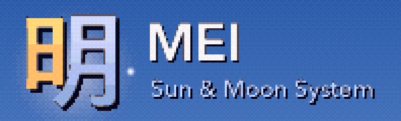

<p align="center"></p>

Mei is a 3D fantasy console in the spirit of the PlayStation era: a 60 MHz RISC CPU, a vector
unit, a 3D polygon processor (the Prism Engine) that only fills triangles, so affine-warped
textures, wobbly vertices and dithered colour come from the hardware rules rather than filters,
and a scrolling plane processor (the Horizon Engine) for skies, floors and backdrops. It has its
own language, Akari, a tiny OS with boot animations and memory cards, and runs on the desktop
(SDL3) or in a browser tab (WebAssembly).

```bash
make && ./build/mei
```

More in [docs/OVERVIEW.md](docs/OVERVIEW.md): building, running, writing a cart, the layout of the
repository, and the [names](docs/OVERVIEW.md#names) of the project's parts.

## Documentation

**Reference**

- [LANGUAGE.md](docs/LANGUAGE.md): Akari, the language, and its standard library
- [ASSEMBLY.md](docs/ASSEMBLY.md): the assembly language and the assembler
- [SYSTEM.md](docs/SYSTEM.md): the system ROM (boot themes and shell)
- [MEMCARD.md](docs/MEMCARD.md): memory cards
- [BROADCAST.md](docs/BROADCAST.md): MeiNet, the data broadcast
- [PLANES.md](docs/PLANES.md): the Horizon Engine, the scrolling plane processor
- [The spec](docs/spec-v0.1.pdf) ([text copy](docs/spec-v0.1.txt)) and
  [DECISIONS.md](docs/DECISIONS.md), how this implementation settles what the spec leaves open

**Tools**

- [ASSETKIT.md](docs/ASSETKIT.md): the Asset Kit, which builds JSON recipes into native meshes
  for agent-driven 3D modelling, and its Asset Checker
- [WORLDKIT.md](docs/WORLDKIT.md): the World Kit, which builds levels from placed assets
- [WORLDPACK.md](docs/WORLDPACK.md): the world pack format
- [WORLDCHECKER.md](docs/WORLDCHECKER.md): the World Checker, the World Kit's in-level
  verification
- [The Reference Renderer](tests/reference_renderer/README.md): the console checked against an
  independent renderer (`make rendercheck`)
- [The Akari extension](tools/vscode-akari/README.md) for VS Code syntax highlighting

**Project**

- [ROADMAP.md](docs/ROADMAP.md): what is planned, undecided and decided against
- [PLATFORMER.md](docs/PLATFORMER.md): the design of the first open-world game
- [AGENTS.md](AGENTS.md): working in this repository, for people and AI agents
