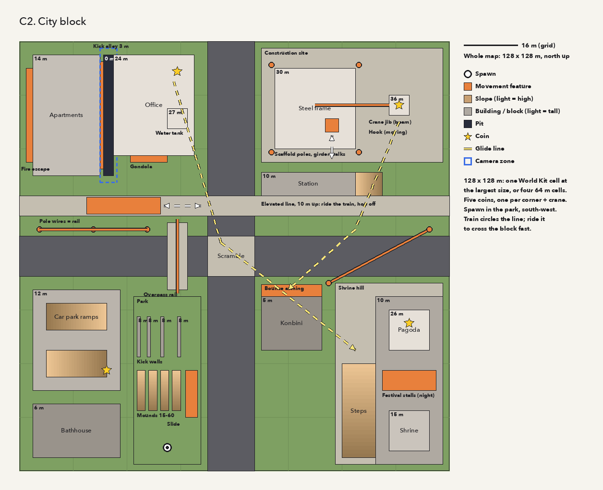

# The movement garden

The cart where the platformer's movement is tuned, and the first level built with the World Kit
and the Asset Kit. The movement design is in [PLATFORMER.md](../../docs/PLATFORMER.md); this file
is the **contract** between the teams building the garden. It changes only through the main
session (the integration branch), never by one team on its own.



`layout.png` is drawn by `layout.py` (`python3 carts/garden/layout.py`); the coordinates in its
`D` list are the plan in metres. It is a sketch: the world lead owns the exact numbers in the
recipe and keeps the sketch roughly in step.

## Teams

| Layer | Who | Owns | Reports to |
|---|---|---|---|
| 0 | Main session | This contract, merges, test runs, the owner | The owner |
| 1 | World lead | `carts/garden/world/`: style sheet, world recipe, cells, placements, collision, entities, the game schema, World Checker results | Main session |
| 2 | Asset workers (7) | Their families' recipes in `carts/garden/world/assets/` | World lead |
| 1 | Controller lead | `carts/garden/*.akr` and `carts/garden/tests/`: character, camera, tuning menu, timing readout | Main session |
| 2 | Camera worker, attachments worker | Their parts of the cart, as the controller lead assigns | Controller lead |
| 1 | Kit engineer | `tools/`, `stdlib/`, `docs/` for kit features the garden needs | Main session |

All agents are Opus. Nobody edits outside what they own; a gap in someone else's area is reported
up, and the main session routes it.

## Files

```
carts/garden/
  README.md, layout.py, layout.png    this contract and the sketch
  garden.akr, game.akr, ...           the cart (controller lead)
  goals.akr                           stars, triggers and flags, a challenge's clock, the saved progress
  art/                                the star's card, packed for slot 14 (see "Goals")
  ground/ground.akr                   the only file that imports the world (the world's
                                      generated garden.akr would clash with the cart's own)
  worlds.txt                          the garden's world, the shrine's and the shrine town's
  shrine/                             the shrine slice: its world, style sheet and assets
  shrinetown/                         the shrine town's grey box: its world, design and generators
  body.akr, robot/                    the player drawn: the wind-up robot, its parts and poses
  world/
    STYLE.md                          the style sheet (world lead)
    garden.world.json, cells/         the world recipe (world lead)
    garden.game.mochi                 the game schema (world lead, to this contract)
    garden.ids.json                   the ID lock file, committed
    assets/                           Asset Kit recipes (workers; collision companions *_col)
  tests/                              harness.akr, run.sh, check.sh (controller lead)
```

The garden is an installed cart: `make` builds it (with its world, which needs NumPy) and the
shell lists it as Movement Garden. Its `tests/check.sh` runs in `make test-carts`.

## World

- **Units:** 1 unit = 1 metre; y is up. The block is 128 × 128 m: **four 64 m cells** (2 × 2), so
  the crossroads lies on the corner where all four meet, which tests seams and cell selection.
- **One region**, `garden`, with palette variants `day` and `night`. A second region is a later
  stage, not the garden. The shrine town has two (`town`, `shrine`): the cart enters the region of
  the cell the player stands in when it changes (`game.akr`, `follow_region()`;
  [shrinetown/TEXTURES.md](shrinetown/TEXTURES.md)).
- **Layers:** `festival` (the stalls and their goals), on at night only; the game switches it.
- **Ground** is explicit Asset Kit meshes per cell until World Kit terrain exists.
- **The grey box comes first:** the world lead builds the whole block from primitives with final
  footprints, heights and collision before any detailed asset, so the controller has ground to
  run on in the first round. A detailed asset then replaces its grey box with the same footprint,
  height and collision.

## Surfaces

Collision triangles carry a surface byte from their material's `tag`
(`collision.surfaces` in the world recipe). Floor, wall and ceiling come from the normal and
`probe.floor_max_degrees`, so steepness is not a surface type.

| Byte | Tag | Meaning to the controller |
|---|---|---|
| 0 | (default) | Normal ground or wall; every wall can be kicked off |
| 1 | `bounce` | Landing launches the player (awning, park trampoline) |
| 2 | `slide` | Cannot be stood on; the player slides down (playground slide) |

New bytes are added here first.

## Entities (the game schema)

`garden.game.mochi` defines these types; the field names below are the contract, the Mochi types
are the world lead's choice. Positions are the entity's placement; offsets are relative to it.

| Type | Fields | Meaning |
|---|---|---|
| `spawn` | `yaw` | Where the player starts |
| `coin` (saved) | `time_window: any \| day \| night` | The collectible; five in the garden |
| `pole` | `height`, `front: bool` | A vertical pole from the placement up; a front pole (a ladder on a wall) is held on the side its yaw faces only, not grabbed from behind, not gone round |
| `rail` | `path` (a World Kit path name) | Something to grind or hang from: overpass rail, wires, crane jib |
| `mover` | `to` (offset) or `path`, `period` (ticks), `pause` (ticks), `mode: pingpong \| loop`, `start` (a flag), `delay` (ticks), collision asset | A moving platform: gondola, crane hook, the train. With `start` it is parked (not drawn, no collision) until the flag is set, waits `delay`, then runs; once the flag is cleared it parks when back at its placement (pingpong) or at its leg's end (loop) |
| `camera_zone` | `size`, `mode: follow \| fixed \| rail`, `look` | Inside it the camera changes behaviour (the kick alley) |
| `door` | `world` (a world of the game), `size` | Walking into the box (rising `size.y` from the placement) opens that world at its spawn: the garden's shrine torii leads to the shrine, the shrine's konbini door back |
| `red_coin` (saved) | | Eight red coins in a level: the shrine's along its forest loop, the shrine town's over its roofs |
| `star` (saved) | `appear` (a flag) | The level's goal, the hanafuda moon card; with `appear`, there only while that flag is set (it comes down into place when it is) |
| `trigger` (saved) | `size`, `how: touch \| press \| pound`, `flag`, `needs`, `keep`, `timer`, `ends`, `on`, `off`, `hide` | A box (its base centred on the placement) that sets `flag` when the body enters it, presses B standing in it (no dive then) or lands a ground pound in it, while `needs` is set and `flag` is not. `keep`: saved. `timer`: the flag is a challenge's, cleared that many ticks later (the clock on the screen). `ends`: a flag it clears (a challenge it ends is won). `on`/`off`: layers switched. `hide`: its mesh hidden while the flag is set |

The game has three worlds (`worlds garden, shrine, shrinetown`): the garden, the shrine slice
([shrine/README.md](shrine/README.md)) and the shrine town's grey box
([shrinetown/README.md](shrinetown/README.md)), which use this schema and this cart's
controller. `ground/ground.akr` opens any of them; water (the shrine's and the town's) slows the
player with its depth, and from deeper than 1 m there is no jump. A world with more movers (8),
poles (128), rails (128), stars (16), triggers (32) or entities (256) than the cart holds stops at
its load (`attach.akr`, `goals.akr`).

Rails, wires and the train's route are **World Kit paths**, which the kit engineer builds first
(they are reserved in [WORLDKIT.md](../../docs/WORLDKIT.md#terrain), not yet built). Until they
land, the grey box places the poles and movers, and the rails come with the paths.

The probe (`probe.radius`, `height`, `step`, `floor_max_degrees`) starts as in
`examples/worlds/test_room/garden.game.mochi` (0.3, 1.6, 0.32, 40); the controller lead may ask
for other numbers through the main session. Its `bridge` (0.4375) is the cracks the body steps
across: `col_stand()` (`player.akr`), which stands the body and lands it, asks `col_floor()` as
before, and only where that finds no floor (the world's or a mover's) within reach asks
`wp_floor_across()`, so a gap of up to about 0.3 m between two floors within a step of the feet
holds the body; the World Checker does not report such gaps
([WORLDKIT.md](../../docs/WORLDKIT.md#cracks)).

## Goals

`goals.akr`. **Flags** are names (`name` parameters); triggers set them, stars and movers wait for
them, and the game sets `red_coins` when the open world's last red coin is taken. They belong to
the world open now: opening a world clears them and sets again those of the triggers it keeps.
A touch trigger fires on entering its box, not while the body stays in it.

**Saved progress** is the worlds' saved bits as the World Kit numbers them (`NAME.ids.json`): a
star taken, a kept trigger fired, 512 bits a world. Coins and red coins are not saved: they come
back whenever a world opens. The progress is written to save 0 of the memory card in slot 1
whenever it changes (the card stays busy a few frames; nothing waits for it), and read at
start-up; without a card it lasts until the cart is reset. Opening a world again (a door, a
reload) keeps it.

**The star** is drawn by the cart, not the world: a world's entity meshes are drawn whichever
texture region is loaded, so they stay untextured ([TEXTURES.md](shrinetown/TEXTURES.md)). The
card (`examples/assets/collect/hanafuda_moon`) is packed into `art/` for texture slot 14, which no
world region uses (it holds the worlds' swatch row, which the pack keeps), and 4-bit palette 254,
above every world's; `moon_load()` copies it once at start-up (8 KB of slot 14, one palette):

```sh
python3 tools/mei_assets.py pack examples/assets/collect/hanafuda_moon/hanafuda_moon.asset.json \
    -o carts/garden/art --name moon --slots 14 --palette 254 --swatch
```

A star turns in its glint (`glint.akr`, `GLINT_MOON`) and is drawn within 160 m of the camera; a
star taken shows its back, still, and touching it again does nothing. The screen shows the
world's stars taken (`moon 2/5`), the red coins once one is taken, and a challenge's clock.

**Worlds may use** texture slots 13–0 and 4-bit palettes 0–253: slot 14 (beyond the swatch row)
and palette 254 are the star's.

## Gates

- **Asset worker → world lead:** the recipe, a passing Asset Checker (`mei_assets.py verify`),
  its preview sheet looked at, and any kit gaps.
- **World lead → main session:** the world builds; the World Checker report with every ordering
  error fixed or explained; fixed-viewpoint screenshots; each asset swap keeping its footprint
  and collision.
- **Controller lead → main session:** cart scenarios that run each move headless; the tuning
  values in one table; the timing readout working.
- **Kit engineer → main session:** the feature with tests and docs, `make test` passing, and
  every existing cart ROM byte-identical.

## How everyone works

- Each agent works in its own worktree and branch, builds into a private directory
  (`make B=build-NAME`), and commits there. Workers branch from (or merge) their lead's branch;
  the lead merges its workers; the main session merges the leads.
- Commit subjects follow [AGENTS.md](../../AGENTS.md): plain descriptions, area first
  ("Garden: grey-box the north-west quarter").
- Nobody pushes. Nobody edits the main checkout.
