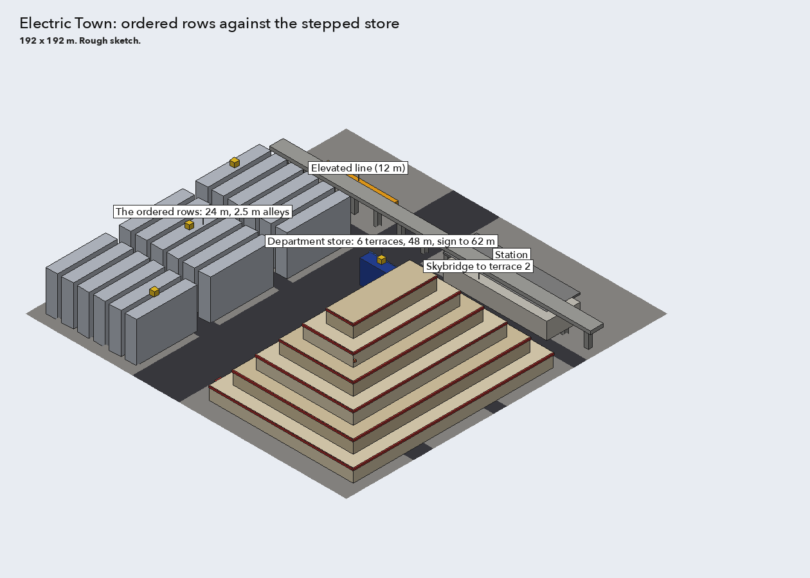
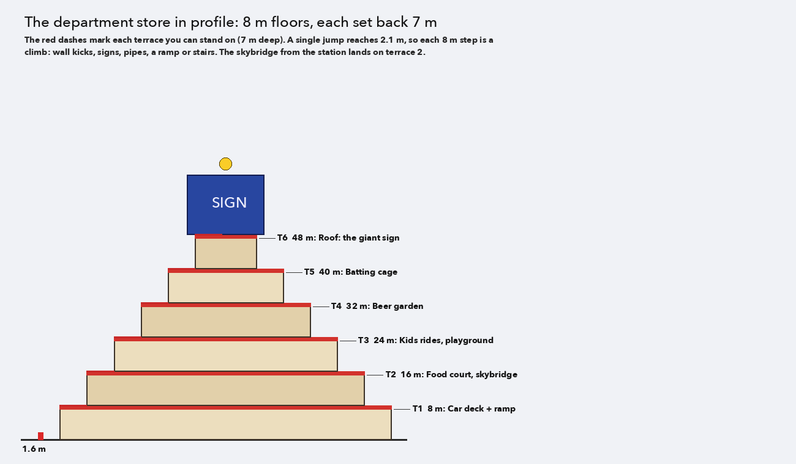

# Electric Town

An area of the platformer: Akihabara around 1995. Designed with the owner on 2026-10-04; nothing
is built yet. `layout.py` draws the sketches beside this file.

## The idea

Contrast: **ordered rows** of identical narrow buildings against **one giant stepped department
store** (a Yodobashi Camera-like block shaped as a slight ziggurat), with an **elevated train line
overhead** between them.

- **The ordered rows** (west of the avenue): identical 24 m buildings in strict lines, one pale
  colour, one sign each, all in step, 2.5 m alleys for wall-kick climbs.
- **The avenue** runs north-south between the rows and the store.
- **The elevated line** crosses overhead at 12 m; its station is north of the store, with a
  skybridge from the platform onto the store's second terrace.
- **The department store** (about 86 × 120 m): six terraces of 8 m floors, each set back 7 m,
  a red band round every floor, a giant sign on the roof (about 62 m) with a coin on top.

## The store, outside: the terraces

| Terrace | Height | Theme |
|---|---|---|
| T1 | 8 m | Car deck, a ramp up the side |
| T2 | 16 m | Food court; the skybridge lands here |
| T3 | 24 m | Kids' rides, a playground |
| T4 | 32 m | Beer garden under lanterns |
| T5 | 40 m | Batting cage |
| T6 | 48 m | Roof and the giant sign |

The player reaches about 5 m from flat ground (a double jump of about 3.4 m and a ledge grab of
about 1.75 m), so every 8 m step needs a trick. Each step face has **one easy route** (fire
stairs, the car ramp) and **two or three skill routes**: stacked AC units and awnings, drainpipes
as poles, a wall-kick chimney between a stand-off sign and the facade, a window-washer gondola, the
sign letters as steps, the kiddie Ferris wheel, a bounce off an awning, lantern wires to grind,
the sign's scaffolding at the top. A missed jump lands on the terrace below, not the street. From
the roof the glider reaches the ordered rows and the train line.

## The store, inside: a floor directory

The lobby (street level) has a floor directory and an elevator; each floor is a **small themed
level** of its own (an interior world behind a door), a 2-4 minute challenge, unlocked as the
player collects. The terraces stay: they are the overworld around the floors.

First version, three floors (decided):

| Floor | Theme | Challenge |
|---|---|---|
| **B1 food hall** (depachika) | Sweets counters, conveyor-belt sushi | Conveyor belts as moving platforms; a timed run before closing |
| **2F electronics** | TV walls, stacked boxes | Climb boxed TVs and speakers; TV walls flicker on and off as platforms (animated textures) |
| **3F toys** | Giant toys | Ride a model train layout; building blocks; a rubber-ball bounce pit |

Later candidates: 1F cosmetics (mirror maze), 4F furniture (futon bounce), 5F sports (demo ski
slope), 6F restaurants (a revolving floor).

## Open

- Whether the line wraps round the store at terrace height (jump from a moving train onto a
  terrace).
- A secret in the ordered rows (one building breaks the pattern).
- Step height: 8 m everywhere, or one 5 m shortcut ledge per face for skilled players (my
  recommendation).
