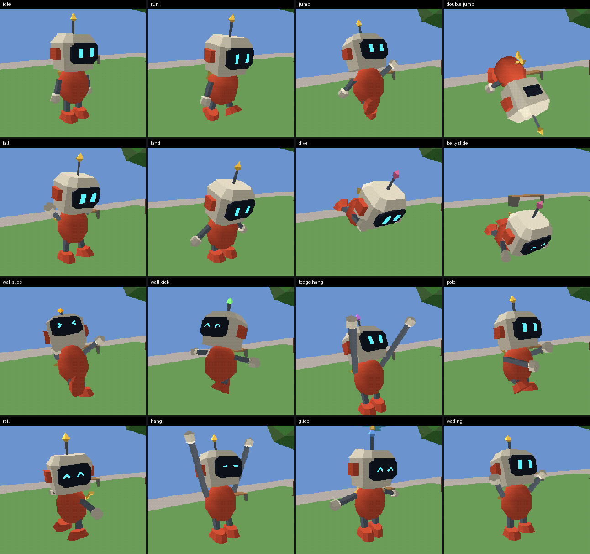

# The robot

The movement garden's player character, a stand-in for the final design: a small wind-up robot
with a box head, a visor with cyan eyes, an antenna gem, telescoping arms and legs, a key in his
back and a propeller that comes out of his head for the glider. He is drawn by `body.akr`; the
movement (`player.akr`, `attach.akr`) and the collision body are unchanged.



## Files

| File | What it is |
|---|---|
| `robot_*.asset.json` | The parts, Asset Kit recipes: head, torso, arm, hand, leg, foot, key, prop. Each part's origin is its joint |
| `art/` | The parts packed (`robot_parts.akr` and the meshes), generated: do not edit |
| `robot.akr` | The rig, the poses and the eyes; `robot_init()`, `robot_draw()` |
| `poses.akr`, `sheet.py` | The pose sheet: the garden with the player held in each state in turn |

After changing a recipe, check it and pack the parts again:

```sh
python3 tools/mei_assets.py verify carts/garden/robot/robot_head.asset.json -o build/robot-check
python3 tools/mei_assets.py pack carts/garden/robot/*.asset.json -o carts/garden/robot/art --name robot_parts
```

The recipes require the Asset Checker in depth mode (`verification`), as the garden draws with
the depth buffer: the parts may cross (the visor and ears go into the head), which the depth
test draws right. All eight pass.

## How he moves

The parts are posed at run time with `mesh_xf()`, a matrix each: the body (about a height of
0.62 m, for flips and dives), the hips, the torso (lean, twist), the head (turn, nod), and for
each side an arm and a leg (out sideways, then swung; the rod scaled to its length) with a hand
or foot at its end. Each tick `want_pose()` makes a target pose from the state (`pl.st`), its
ticks (`pl.t`) and the movement, and the drawn pose eases toward it (30 % a tick, more for
quick moves), so changes of state blend. Flips and twirls are whole-body angles that end on a
full turn, and the blend takes the short way round, so they come back upright without
unwinding.

| State | Pose |
|---|---|
| ground | idle: breathing, a look round after 2.5 s, a foot tap when bored; walk and run: a cycle by distance (a stride of 0.9 m to 2 m), lean and bank with speed; a squash on landing |
| skid, crouch, crouch slide, slide | braced back; squatting (legs short); arms back; surfing sideways |
| jump | a knee up, the other arm up; falling: the fall pose |
| double jump | a tucked front somersault, then spread |
| third jump | a double twirl, arms out |
| long jump, backflip, side flip, rollout | stretched forward; a back somersault; a sideways roll; a front roll |
| fall | arms up and waving, legs kicking, eyes wide when falling fast |
| wall slide, wall kick | hands and a foot on the wall; flung out, a twirl when the kick was good |
| ledge hang, ledge climb | hanging from stretched arms; the hands stay on the ledge as the body comes up |
| ground pound | a tucked spin, a straight drop, a squash |
| dive, belly slide | flat out, arms forward; on his belly, feet kicking |
| pole | hugging it, hand over hand as he climbs |
| rail, hang | grinding sideways with arms out, wobbling; hanging from stretched arms, shuffling |
| glide | the propeller spinning, arms out, banking into turns |
| wading | arms held up out of the water, knees high |

The eyes are a small mesh in RAM, rewritten each frame: open, a blink every 2.5 to 5.5 s,
happy (`^ ^`), wide, squint (`> <`). The gem shows the state's colour as the stand-in box did
(`state_colour()` in `body.akr`): yellow, green for a good wall kick, yellow-green for a late
one, orange on a wall, blue gliding, purple on a ledge, brown pounding, pink diving. The gem
sways on a spring with the body's acceleration; the key turns faster the faster he goes.

**Wading** reads `body_wade()` in `body.akr`, the water depth at the feet. The garden has no
water, so it returns 0 (or the pose sheet's `body_test_wade`); a world with water answers there
(the shrine branch's `pl_wade`).

## Cost

Measured with `sheet.py`, the camera 2.1 m from him: about 51,000 CPU cycles a frame (49,500
to 57,400 by pose; the glider's propeller is the dearest), 8.5 % of the world's 600,000 draw
limit and 5 % of the frame. The rig and poses are about 2,000 of it; the rest is 12 `mesh_xf()`
calls (13 gliding) and their faces, about 100 cycles a triangle. 324 triangles in all (the
propeller's 52 only while gliding). The GPU draws him for about 57,000 cycles at that distance
(the frame drawing only him and a clear of 38,400 measures about 95,500), 3.6 % of the
1,600,000 limit, and less from the game's usual 6.5 m, where he covers fewer pixels.

## The pose sheet

```sh
python3 carts/garden/robot/sheet.py build/robot-sheet --build build          # front quarter
python3 carts/garden/robot/sheet.py build/robot-sheet --build build --behind # the game's view
```

It builds `poses.akr` against the garden's world (build the garden first), holds the player in
each of 16 states for 48 frames, lays the last frame of each out in `poses.png` (or
`poses_behind.png`) and prints the robot's CPU and GPU cycles per pose.

The tests hold his pose still with `robot_hold` (the body scenarios count his red pixels on two
frames, `tests/harness.akr`).
