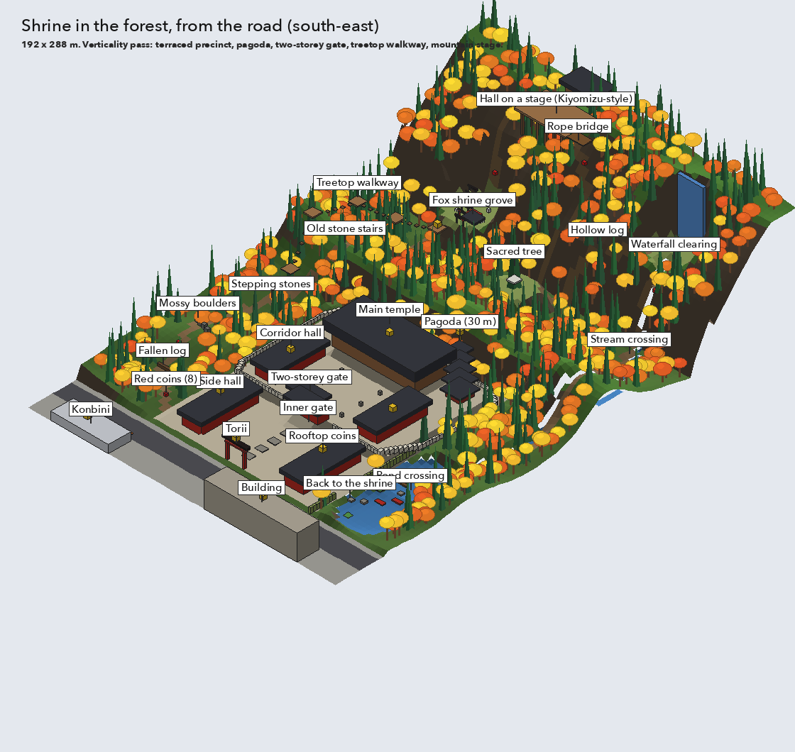
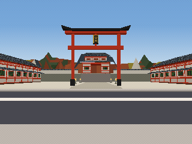
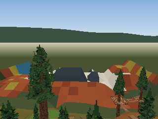
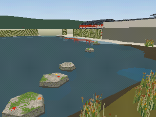
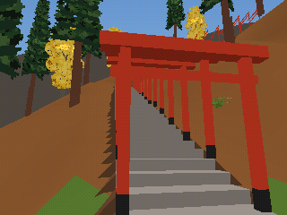

# The shrine slice

A vertical slice of the platformer: one Mario 64-sized level taken all the way (terrain,
textures, dense props, life and sound, things to do), to learn how much *stuff* a fulfilling
space needs and what it costs. The owner's vision, from a shrine they visited in Kyoto: a shrine
encircled by a giant forest you can go through. Designed with the owner on 2026-10-04; built as
the world `shrine` in the garden cart ([What is built](#what-is-built)).

`layout.py` draws these sketches (`from_road.png`, `from_mountain.png`, `top.png`) from a rough
height model and an object list. The numbers below are the plan in metres; the world recipe will
own the exact ones.

## Size and shape

192 × 288 m (x east, north up): the road at the south, the shrine in the middle, the forest all
round it and running 96 m further north up a back mountain of about 60 m.

## Zones, south to north

- **The street:** a konbini and a building south of the road, the big torii at the road.
- **The outer courtyard** (street level, raked gravel): a stone approach between two long red
  side halls.
- **The inner precinct** on a 5 m stone terrace inside a white wall, entered through a two-storey
  red gate (about 17 m): two corridor halls, stone lanterns, the main temple on an 8.6 m platform
  at the back, and a five-storey pagoda (about 30 m) in the north-east corner.
- **The forest:** red maples, yellow ginkgo and tall cedars, rising to a wooded ridge (about
  20 m) behind the temple, then a deep northern forest climbing the back mountain, with a cliff
  band near the top.
- **The pond** east of the shrine, fed by a stream from the waterfall.

## The forest loop

One trail, entered at the south-west and ending at the shrine:

1. Fallen log, mossy boulders, stepping stones (west forest, ground level).
2. The **treetop walkway**: wooden platforms on giant cedars from about 10 to 24 m, joined by
   rope bridges.
3. The **clearings**: the **fox shrine grove** (a little tunnel of torii, a vermilion shrine, fox
   statues), the **sacred tree** (a huge cedar with a shimenawa rope), the **waterfall clearing**
   (falls of over 30 m off the back mountain).
4. The summit: a **hall on a Kiyomizu-style stage** on stilts, reached over a rope bridge, with
   long glide lines down towards the waterfall and the sacred tree.
5. Down the stream (a hollow log, a stream crossing) to the **pond crossing**: stepping stones,
   bobbing logs, a stretch of zig-zag red bridge, lily pads.

**The pond is mandatory:** the shrine's wall has no north or east gate and a bamboo fence closes
its east side, so the only way out of the forest and back to the shrine is across the pond.
**Water is wading:** falling in slows the player down; there is no swimming.

## Collectibles

- **8 red coins** along the forest loop.
- **Coins on the rooftops:** the main temple, the four halls, the two-storey gate, the torii, the
  konbini and the building; the pagoda's top and the highest treetop platform.

## Decided

- The slice is this shrine (the owner's sketch), grown to a full level rather than a corner.
- Verticality: the terraced precinct, the pagoda, the gate, the treetop walkway, the mountain
  stage.
- Pond crossing mandatory; water is wading.
- The slice is a second world in the garden cart, reusing its controller, camera and tests.

## What is built

 
 

The world `shrine` (`shrine.world.json`, `cells/`, `assets/`, the style sheet `STYLE.md`) is the
second world of the movement garden's game (`../world/garden.game.mochi`: `worlds garden,
shrine`). The garden cart opens it through a door: the torii at the foot of the garden's shrine
hill leads here, to the spawn on the road; the konbini's door leads back. More screenshots are in
`screenshots/`, drawn by the real reader (world only, no player).

**The ground.** One heightfield over 192 × 320 m at 2 m (15,360 quads in 240 tiles of 16 m;
13,088 triangles at level 0, 9,036 at the coarse level from 22 m), with cliffs for the 4.55 m
terrace and its stone retaining wall, the kerbs, the rim walls the level ends at, the rock
outcrop and the waterfall's 18 m cliff; the pond (water at 0, bed at -1.1 to -1.7) and the west
spring as water operations; the stream draped downhill from the waterfall's pool to the pond.
x is east, z north: the street is z 0–32, the outer courtyard z 32–80, the terrace z 80–150
(top 5.0), the ridge behind it, the back mountain rising from z 200 to about 60 m. The level
ends at rock rims (west, east, north) and road-works barriers (the road's two ends).

**The forest loop**, all of it walked and jumped by the scenarios below with the default tuning:
the trail from the courtyard's west edge past the fallen log and the mossy boulders; six
stepping stones across the spring; the old stone stairs up the outcrop (14 m); the treetop
walkway, five decks on giant cedars at 14, 17, 20, 23 and 26 m joined by rope bridges, the last
one down to the fox shrine's grove (26 m); a tunnel of 28 small torii up switchback stone steps
to a landing at 50 m and a rope bridge to the hall on its stage (deck at 56 m, on stilts over
the slope); a path down the east side to the sacred cedar (12 m); through the hollow log over a
gully to the waterfall's pool (18 m; the falls are 34 m); down the stream's west bank, across
it on three stones, down the east bank to the pond; the crossing (four stones, a bobbing log, a
stone, a second log, two stones, the zig-zag bridge, a stone, two lily pads, a stone) to the
landing at the gap in the courtyard's bamboo fence.

**Coins.** Eleven on the rooftops: the side halls, the corridor halls, the gate, the temple, the
torii's top beam (its posts are poles), the pagoda's top tier, the konbini, the building and the
highest treetop deck. Eight red coins along the loop: on the fallen log, the tallest boulder, the
spring's middle stone, the third deck, the fox statue, the stage's front, inside the hollow log
and on the stream's middle stone. `red_coin` is a new saved type of the game; the cart counts
them apart.

**Wading.** The cart slows the player on foot by water depth (to 35% from 1.2 m down) and allows
no jump from deeper than 1 m (`carts/garden/player.akr`); the pond is 1.1–1.7 m deep, so wading
across is possible but slow, and the stones are the way.

**Things placed.** 50 asset recipes (with their collision companions) by five workers: the
shrine's architecture (great torii, two side halls, two corridor halls, the two-storey gate, the
temple on its podium, the pagoda, the white wall in 8 and 4 m pieces and corners), the foliage
(maple, small maple, ginkgo, cedar, the giant walkway cedar, the sacred cedar, five undergrowth
plants, two leaf-litter patches), the forest's built things (treetop deck, bridge posts, fox
shrine, small torii, fox statue, the stage hall, stone lantern, fallen and hollow logs, two
boulders), the water (the animated waterfall, three stepping stones, the bobbing log, the zig-zag
bridge, two lily pads, reeds, the bamboo fence) and the street (konbini, the 1990s building,
vending machine, utility pole, street lamp, guardrail, barriers). Scattered: 309 trees (maples,
ginkgo, cedars), 371 undergrowth plants, 114 leaf-litter patches, 46 reed clumps. Far cells draw
as stand-ins, canopy sheets sampled from the world by `standins.py`. Texture VRAM: 84 tiles,
59,901 bytes (71,104 on the 8-texel grid) in slots 11–13.

**What it costs** (the World Checker, depth mode, 600 views, report mode): peak 3,023
triangles, 681,077 draw CPU cycles, 1,058,081 GPU cycles; 9 views over the 600,000-cycle draw
budget, all in the forest's north-west and on the mountain, where the torii steps (982 triangles
of sweep in two cells) and the stage hall meet. 15 cells, 805 placements, a 6.4 MB pack. The
collision report has 44 cracks of the known kind (narrow walls where sweeps, beds and steep
banks meet floors; none on a seam) and 4 edge mismatches inside assets' collision.

**Tests.** `carts/garden/tests/shrine_cases.akr`, scenarios 300–309, run by `check.sh`: the
spawn and the walk through the great torii; wading; the west forest; the pond crossing; the
treetop walkway; the torii steps, the stage and the way down; the hollow log, the falls and the
stream; every coin reachable and taken; both doors.

**How it is made.** The recipe is JSON written as the source (the world lead's working
generator is not kept); `standins.py` regenerates the stand-ins after the terrain changes.
The assets' PNG textures are drawn by the scripts beside them in `assets/art/`
(`draw_arch.py`, `draw_foliage.py`, `draw_forest.py`, `draw_water.py`, `draw_street_sheet.py`;
`make_foliage.py` writes the foliage recipes). Building needs Pillow for those textures.

## Open

- A shortcut back into the forest after the loop (a gate that opens, Mario 64-style).
- Goals beyond coins: the bell, the night festival, omikuji slips, the fox shrine, a cat; and how
  many for a level this size.
- Day and night (the festival at night): the region has a night variant (surfaces times
  `#4a5884`, lanterns emissive); nothing switches it yet.
- Gliding from the stage or the ridge can still reach the precinct over its wall, around the pond.
- Sound: the waterfall heard before it is seen (no audio banks yet).
- The far forest: the stand-ins read as a patchwork from the stage, and the near pass ends at
  72 m (`runtime.near_far`), so the forest thins out beyond it.
