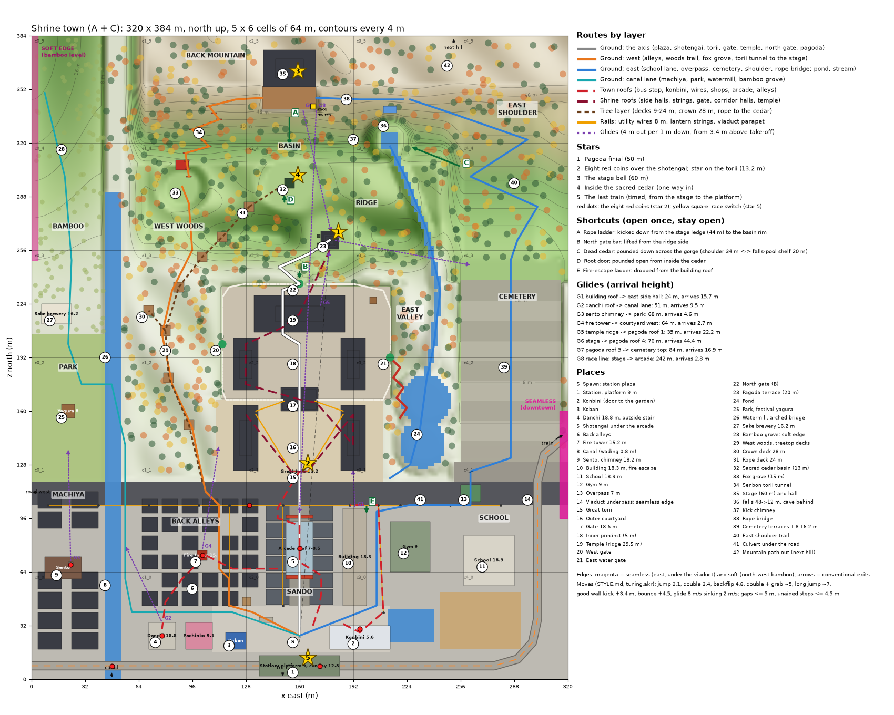
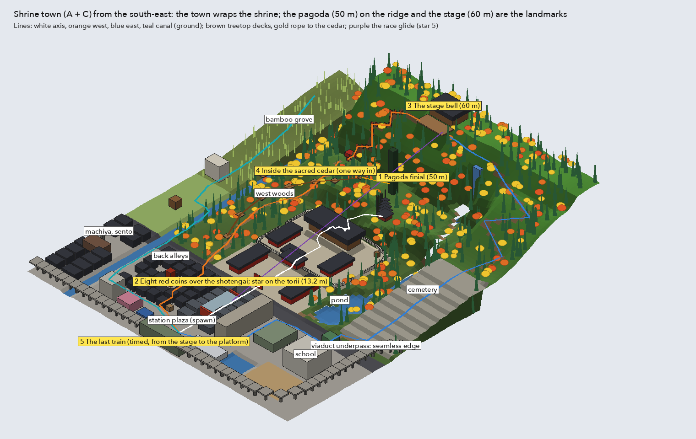

# Shrine town: design specification (A + C)

The whole shrine of direction A (courtyard, terraced precinct, ridge and pagoda, west woods and
their treetop walkway, the sacred cedar's basin, the fox grove and its torii tunnel, the back
mountain with its stage, the falls and the stream) placed unchanged in shape inside the temple
town of direction C (a station plaza, a covered shopping street to the great torii, back alleys,
a canal with machiya and a sento, a park, a schoolyard, cemetery terraces and an elevated railway
that wraps the south and east). It is one level of the future city world: 320 × 384 m, 30 cells,
five stars.

Written as a paper design, now built as a grey box: the world `shrinetown` in the movement
garden (README.md). Every height, gap and glide below was checked against the player's moves in
`carts/garden/tuning.akr` and `carts/garden/shrine/STYLE.md`; the coordinates and checks live in
`layout.py`, the pictures are drawn from it by `tools/draw.py`:

- `design/top.png`: the map: zones, contours, routes by layer, stars, red coins, shortcuts,
  glides, numbered places, the edges and the 64 m cell grid.
- `design/oblique.png`: the level from the south-east.
- `design/sections.png`: three cuts: south-north on the axis (x = 160), west-east through the
  basin (z = 296) and west-east through the town (z = 70).
- `design/assets.md`: the asset list and how to split it.

**Where the grey box changed the plan,** this document says so in place (marked *Grey box:*)
and section 12 lists every change, with the cart scenarios that measured it. Where a number
below and section 12 disagree, section 12 and `layout.py` are the level as built.

Numbers in brackets like (23) are the numbered places on `top.png`; ★1–★5 are the stars.

---

## 1. Design philosophy

### 1.1 A playground, not a path

The built shrine is one trail with a mandatory pond. This level has no required order and no
single trail. Concretely:

- From the spawn there are seven directions within 10 seconds (section 4.1).
- Every zone touches at least three others on the ground, and most also on a roof or tree layer.
  The only places with a single way in are deliberate: the sacred cedar's hollow (★4) and the
  sento chimney's top (a red coin).
- The precinct has five ways in (main gate, west gate, east water gate, north gate, over the
  4.4 m retaining wall); the mountain has five ways up (section 5, ★3).
- The pond is optional: it is the shortest way from the east gate to the road, not a gate.
- Shortcuts (A–E) shorten loops that already exist. None of them is needed to reach any star.
- No zone is a dead end except a goal. Where a walk ends (the bamboo grove's top, the falls
  cave), it ends on a view or a secret, and a glide or a drop takes you back.

### 1.2 One spine, two grains

The axis x = 160 runs from the station (1) up the shotengai (5), through the great torii (15),
the gate (17), the temple (19) and the north gate (22) to the pagoda terrace (23), and on in line
to the basin (32) and the stage (35). It is the one route you can always find: stand anywhere on
it and look north or south and you see its next landmark.

Across it the town has a rectangular grain (alleys east-west, the canal north-south, the
viaduct as the south and east frame) and the forest an organic one (contours, trails that follow
them, clearings). The player learns two kinds of navigation in one place: counting blocks in the
town and following landmarks and slopes in the forest.

### 1.3 Landmarks and sight lines, one per quarter

| Landmark | Height | Where | Seen from |
|---|---|---|---|
| Pagoda | 45 m (base 15; *grey box:* the real pagoda on a terrace cut 5 m into the ridge) | (178, 262) | everywhere south of the ridge; from the spawn only its finial's top shows over the arcade gate (below) |
| Stage hall | deck 60, roof about 78 (set by the asset) | (154, 360) | the whole level (far stand-in from the town) |
| Falls | 48 → 12 m white line | (214, 340) | the east half, the cemetery, the pond |
| Sacred cedar | 58.8 m (base 13) | (154, 296) | the ridge, the walkway, the stage; the only tree taller than the pagoda |
| Sento chimney | 18.2 m | (23.5, 68.5) | the west half of the town |
| Fire tower | 15.2 m | (102, 74) | the alleys and the danchi |
| Building | 18.3 m, 58 m long | x 186–200 | the plaza, the courtyard, the school |
| School | 18.9 m | (273, 71) | the east and the cemetery |
| Viaduct with its trains | deck 9 m | south and east edges | everywhere in the town; it is the level's frame |

The spawn sight line, checked: eye 1.6 m at z 22 looking north. The arcade gate's top (8.3 m at
z 62) cuts the view at a rise of 0.167; the pagoda (z 262, 240 m away) is visible above
1.6 + 0.167 × 240 = 41.8 m, so its fifth roof (44.0) and finial (50.0) show over the gate.
*Grey box:* with the real pagoda (roof 5 at 19.4 above its base) on the terrace at 15, roof 5
is at 34.4 and the finial's top at 45: only the finial's top 3.2 m clears the gate, and the
reader's far ring of three (`wp_far_ring`) does not draw row 4 from row 0 at all (section 12). The
temple ridge (29.5 m at z 218) is just hidden behind the gate; the torii's red frame sits inside
the arcade's mouth. The stage hall's roof (about 78 m, 343 m away) is above everything (rise
0.22).

### 1.4 Three layers and a summit

| Layer | Heights | What it is made of | How you get onto it |
|---|---|---|---|
| Ground | 0 (town), 0.6 (courtyard), 5.0 (terrace), 13–20 (basin, ridge) | streets, gravel, trails, water (wading) | walking |
| Roofs | town 5.6–9.5 (shops, konbini, alleys, machiya, arcade, viaduct 9), towers 15–19; shrine 11.6–29.5 | flat or ≤ 28° roof collision, wires and lantern strings as rails | bounce awnings, vending machines, poles, ladders, double jump + grab |
| Trees | decks 9–28 m | treetop decks on giant cedars, rope bridges, the rope to the cedar | the walkway's foot at the courtyard, the ridge's west end, a trunk pole |
| Summit | 44–64 | the stage, the falls' top, the shoulder | stairs, kicks, ladder, the long trail |

**Up is earned, down is free.** Every climb uses a move (double jump and grab, a pole, kicks, a
bounce); every high place has a glide line down that lands somewhere useful (section 4.4). The
glider sinks 2 m/s at 8 m/s, 4 m out per metre down, and opens at the apex of a double jump, so
every glide starts 3.4 m above its take-off.

### 1.5 Town and forest: contrast, then blend

The town is low, dense, horizontal, busy and loud: roofs at 6–9 m, people, trains every 90 s, a
grain of 10 m shop frontages. The forest is high, sparse, vertical and quiet: cedars of 25–41 m,
decks, water you hear before you see. Crossing from one to the other always goes through a
threshold you can name: the great torii, the precinct's gates, the arched canal bridge (26), the
cemetery's gate, the bamboo. Each is a small version of the seamless edges between levels
(section 7): the scene changes behind something, and you know you are somewhere new.

Where they blend, on purpose:

- **The canal lane** (x 52–60): machiya backs on one side, the west woods on the other, stone
  lanterns along it.
- **The courtyard's open sides**: west into the woods trail, east onto the pond bank.
- **The cemetery terraces** climb out of the town's grid into the mountain's east shoulder.
- **The bamboo grove** grows from the park and the sake brewery up to the north-west edge.

### 1.6 How the player learns the space

1. The spawn shows the goal: the pagoda over the arcade, the stage on the skyline.
2. The first roof is 3 seconds away and teaches the roof layer (the awning bounce onto the
   shotengai roofs).
3. Coins are breadcrumbs on lines that are not obvious: along the wires, up the pagoda's tiers,
   across the kick pair, on the glide line from the temple ridge.
4. Each star teaches a skill the next can use: ★2 rails and roofs; ★1 tier climbing and the
   glide from height; ★3 three faces of one mountain; ★4 seeing something from one place and
   reaching it from another; ★5 the whole map at speed.
5. Things are seen before they are reached: the cedar's glow through its roots, the rope with
   its white paper streamers from the walkway, the falls' cave from the stream.

### 1.7 Rewarding curiosity

- Secrets sit at the end of side lines (section 6.3): the cave behind the falls, the culvert
  under the road, the crown deck's view, the sake brewery's roof.
- Every summit has a view and a way down.
- Shortcuts open from the far side, so finding the far side is the reward.

### 1.8 What "open" means here

Measurable: seven directions in the first 10 s; every star reachable by at least two routes
except ★4 (one, by design); at least three ways into every zone; no invisible walls. The level's
boundaries are things: the viaduct (south, east), the canal's culvert grille (south-west),
road-works barriers (west road), the mountain's rims (north). Open does not mean empty: inside
the town, alleys and shop rows still frame views and hide what is behind them, which both reads
as a real town and keeps the frame budget (section 8).

### 1.9 Built for the budget

Heavy zones are kept apart (the shotengai and the precinct are 60 m apart across the front road
and the courtyard); high places have nothing heavy within 30 m; streets dog-leg so no view runs
more than about 64 m along a dense street except the axis, whose contents are budgeted.

---

## 2. Overview

### 2.1 Size, coordinates, heights

- **320 × 384 m**, x east 0–320, z north 0–384, heights in metres above the street (0).
- **Cells:** 64 m (WORLDKIT.md recommends 64 until stage 2 measures; the shrine uses 64), so
  **5 × 6 = 30 cells**, `c{col}_{row}` with col = x / 64, row = z / 64. The built shrine has 15.
- Direction A's shrine sits at A's x + 64, z = 280 − A's y; its internal numbers are unchanged
  except where this document says so.
- Lowest: −1.2 (canal and pool beds); highest ground 64 (north-east summit); highest things:
  the stage hall's roof (about 78), the sacred cedar (58.8), the pagoda (45; the plan's 50).

| Level | Height (m) |
|---|---|
| Canal water / bed | −0.4 / −1.2 (0.8 m deep: wading, jumping allowed) |
| Pond water / bed | 0 / −1.1 to −1.7 (as built) |
| Town, front road | 0 |
| Courtyard, park | 0.6 |
| Precinct terrace | 5.0 (retaining wall 4.4 above the courtyard; white wall 2.6 on top) |
| Temple podium / ridge | 8.6 / 29.5 |
| Cemetery terraces | 1.8 to 16.2 in nine steps of 1.8 m |
| Basin / fox grove / falls pool | 13 / 15 / 12 |
| Ridge / pagoda terrace | 20–22 / 15 (*grey box:* cut into the ridge, section 12) |
| Torii tunnel landing | 54.5 |
| Stage deck | 60.0 (stilts 12 m at the front) |
| Falls lip | 48 |
| North-east summit | 64 |

### 2.2 Zones and cells

| Row (z) | c0 (x 0–64) | c1 (x 64–128) | c2 (x 128–192) | c3 (x 192–256) | c4 (x 256–320) |
|---|---|---|---|---|---|
| r5 (320–384) | bamboo top, soft edge | torii tunnel top, landing | stage, hall, ladder A | falls, kick chimney, rope bridge | shoulder top, path out |
| r4 (256–320) | bamboo, canal spring | fox grove, decks 5–6, rope deck | pagoda, ridge, basin, sacred cedar | gorge, falls pool, dead cedar C | east shoulder trail |
| r3 (192–256) | bamboo foot, sake brewery | west woods, decks 3–4, crown deck, west gate | temple, corridor halls, north gate | bell, east gate, stream | cemetery top |
| r2 (128–192) | park, yagura, watermill | west woods, decks 1–2 | courtyard, side halls, gate | side hall E, pond, zig-zag bridge | cemetery, viaduct leaving |
| r1 (64–128) | sento, machiya, road W | alleys N, fire tower, woods' foot | shotengai N, arcade, torii | building, gym, pond S, culvert | school, overpass, underpass seam |
| r0 (0–64) | machiya, canal, viaduct | danchi, pachinko, alleys S | station, plaza, shotengai S | konbini, building S, pool | sports ground, viaduct curve |

One region (`shrine_town`), palette variants `day` and `night` (section 6.5).

---

## 3. Zones

Each zone: purpose, layout, heights, landmarks, ways in and out, secrets, what you see.

### 3.1 Station and plaza (1)–(4), c1_0–c3_0

- **Purpose:** the spawn, the hub of the town, the conventional exit (trains).
- **Layout:** the viaduct runs east-west along z 2–14 (deck 9.0, parapet top 10.2, 12 m wide,
  piers every 16 m). The station is the stretch x 136–184: a 40 m island platform on the deck
  (`station_platform`), canopy 12.8, a concourse under the deck with ticket gates, and two
  stairs from the plaza (18 m long, 9 m rise, 26.6°). The plaza (x 108–214, z 16–44) holds the
  spawn (160, 26) facing north, the koban (122, 24), the bus stop (140, 36), the konbini
  (x 178–214, z 18–32, roof 5.6, its door the way back to the garden), the pachinko parlour
  (x 92–108, roof 9.1) and the danchi (x 70–86, z 18–34, roof 18.8, outside stair), a phone
  booth, a newsstand, bike racks and a taxi rank.
- **Out:** north up the shotengai; the stairs to the platform; the awning bounce at the
  shotengai's mouth; the konbini roof and its pole; west into the alleys and to the canal; east
  to the school lane.
- **Seen:** the arcade and the torii in its mouth; the pagoda's top over it; the stage on the
  skyline; the building's long flank to the right; the trains overhead.
- **Secret:** the station canopy's top (12.8) holds a red coin; from the platform, double jump
  and grab (3.8 m up).

### 3.2 Shotengai (the sando) (5), c2_0–c2_1

- **Purpose:** the town's spine and its rooftop highway.
- **Layout:** the street x 154–166 from z 44 to the front road at z 104; six shops a side at
  10 m frontage on x 140–154 and x 166–180. Two-storey roofs 6.5 m; three-storey 9.5 m (west
  z 54–64 and 94–104; east z 64–74 and 94–104). An arcade roof covers z 62–94 (eaves 7.0, ridge
  8.5, walkable 15°), with arcade gates (8.3 m) at z 60 and z 96. Six shops have awnings at
  2.6 m tagged `bounce` (+4.5 m: 18 m/s, apex 18² / 72 = 4.5), which land on their own 6.5 m
  roofs. Service lanes 2.5–3 m behind both rows; the west lane opens into the alleys.
- **Heights to remember:** 6.5 → 9.5 is a 3.0 m step (double jump); shop roof to arcade eave
  0.5 m; the gaps between neighbouring shops are 1 m.
- **Seen:** down the street, the torii framed by the north arcade gate; from the roofs, the
  whole precinct and the pagoda.

### 3.3 Back alleys (6)–(7), c1_0–c1_1

- **Purpose:** close, twisting ground; a dense roof layer at 6–8 m; the fire tower.
- **Layout:** 24 houses of about 9.5 × 8.5 m on x 66–136, z 44–104, roofs 6, 6.5, 7 or 8 m,
  alleys 2.5–3 m. Three empty yards break every straight line, so no alley runs more than two
  houses straight. The fire tower (`fire_tower`, 15.2 m) stands in its yard at (102, 74), its
  ladder a pole. The dagashi shop with a gachapon and a jizo at the corner (126, 46).
- **Roof layer:** neighbouring roofs differ by at most 2 m and stand 2.5–3 m apart: a running
  jump. The fire tower's top is 7.2 m above the highest roof: ladder only, or kicks between the
  tower and the house 3 m east of it (two good kicks, +3.4 m each).
- **Camera:** the alleys are narrower than the camera distance (6.5 m), so each alley is a
  `camera_zone` (`rail` along the alley, raised to look down).
- **Out:** the front road; the canal lane; the danchi; the shotengai's service lane.

### 3.4 Canal and machiya (8)–(9), c0_0–c0_1

- **Purpose:** the west edge of the town, water you can wade, the sento chimney.
- **Layout:** the canal x 44–52 from the spring (48, 292) south to under the viaduct (z 0):
  water at −0.4, bed −1.2, stone banks 1.2 m. 0.8 m deep: the player wades (slowed by depth, as
  built) and can still jump (no jump only from deeper than 1 m), and climbs out with any jump.
  Bridges: a footbridge at z 60, the front road's bridge, the arched bridge at z 160 into the
  park, a plank bridge by the watermill at z 196. Machiya in two rows (x 4–18 and x 24–40, roofs
  7.5 and 7.0) from z 18 to 104. The sento (x 8–30, z 60–73, roof 8) with its chimney (18.2 m)
  at the back: an iron ladder (a pole) from the boiler-room roof (5 m) is the only way up.
- **Seen:** the woods across the canal; the chimney from the whole west; the viaduct crossing
  the canal at z 8.

### 3.5 The front road (13)–(14), c0_1–c4_1

- **Purpose:** the east-west street joining every zone along the shrine's south face.
- **Layout:** z 104–118, two lanes and sidewalks. Utility poles every 30 m (9 m, poles) carry
  wires at 8 m (rails, grind or hang). The great torii stands just north of it. The pedestrian
  overpass (`overpass`, deck 7) crosses at x 256–268 from the school to the cemetery lane. A
  culvert takes the pond's outflow under the road at x 230–242. East, the road passes under the
  viaduct (the seamless edge, 7.1); west, it crosses the canal and ends at road works (7.3).

### 3.6 Outer courtyard (15)–(16), c2_1–c3_2

- As direction A: raked gravel at 0.6 m (x 110–210, z 118–167), the great torii (13.2 m, posts
  are poles), two side halls (roofs 11.6) at x 122–134 and 186–198, open on both sides.
- **Lantern strings** (rails): from each end of the torii's top beam down to the nearer side
  hall's north-west or north-east roof corner, and from each side hall to the gate's lower roof
  (11.0). Hang (2.5 m/s) or grind (6–14 m/s).
- New dressing: a chozuya (water pavilion), komainu, an omikuji rack, an ema board, the shrine
  office.

### 3.7 Inner precinct (17)–(22), c1_3–c3_3

- As direction A: the 5.0 m terrace (x 114–214, z 167–234) behind a 4.4 m retaining wall and a
  2.6 m white wall; the two-storey gate (lower roof 11.0, upper roof 18.6); corridor halls (roofs
  15); the temple on its 8.6 m podium (ridge 29.5); the bell pavilion (9.7) at (204, 226).
- **Four gates:** south (the main gate), west (114, 200) to the woods, east water gate
  (214, 192) onto the zig-zag bridge, north (160, 236) to the ridge stair, barred until
  shortcut B is lifted from the ridge side.
- **Over the wall:** the retaining wall is 4.4 m from the courtyard (double jump 3.4 + grab:
  about 5 m). From the woods, where the ground is about 3 m, the wall's top (7.6) is 4.6 m up;
  mossy boulders (1.7–2.8 m) mark the three places where it is easy.

### 3.8 Ridge and pagoda (23), c2_4

- The ridge (crest 20–22 m at z 262) runs from the west woods (x 84) to the gorge (x 252). The
  pagoda (A's, moved; `arch_pagoda` is 30 m) stands on a 13 m terrace at (178, 262), base 20.
  Its five roofs at 24.8, 29.6, 34.4, 39.2 and 44.0 m (4.8 m apart; each eave 1.8 m deep, each
  tier 0.5 m narrower), the finial a pole from 44.0 to 50.0.
  *Grey box:* the pagoda is the shrine's real one (owner, 2026-10-05), with its climbing
  collision `arch_pagoda_col`: eave tops 5.0 / 8.6 / 12.2 / 15.8 / 19.4 above its base (3.6 m
  apart), eave half widths 5.4 / 4.7 / 4.0 / 3.3 / 2.6, a 0.7 m strip of each roof outside the
  eave above (27.9°), the dew basin's flat top at 21.19, the finial a pole 8.8 m from it. Its
  terrace is cut into the ridge at 15 (G5, section 12): roofs at 20.0, 23.6, 27.2, 30.8 and 34.4,
  the dew basin at 36.19, the finial's top at 45. A stone lantern (top 16.4) stands in front of
  its south face: the step to roof 1.
- A stone stair dog-legs from the north gate (5 m) to the terrace (20 m): 50 m of steps, 17°.
  *Grey box:* a straight stair on `layout.py`'s line, (160, 5, 234) to (172, 15, 254), 23 m at
  23°.
- Two cedars stand 3.2 m apart, trunk face to face, west of the pagoda at x 164 and x 169
  (z 262): the kick pair (★1). *Grey box:* north and south of each other at x 171.35 (z 259.5
  and 264.5, faces 3.2 m apart along z), their faces 1.05 m west of roof 2's eave line; trunks
  to 34.5, crowns 34–38, under the glides G6 and G8.
- From here: the whole precinct below, the town beyond, the cedar's crown and the stage above.

### 3.9 West woods and the treetop walkway (29)–(31), c1_1–c1_4

- Ground 1–3 m sloping up to 8 at the ridge's west end; the trail from the front road
  (104, 112) north along the woods to the fox grove; the canal lane on its west side.
- **Decks** (A's, on giant cedars): 9 m at (94, 152), 12 (82, 180), 15 (80, 208), 18 (88, 234),
  21 (102, 252), 22 (114, 264), joined by rope bridges that rise 3 m over 25–30 m (≤ 7°). The
  last deck is 3.2 m above the ridge's west end (18.8): a jump and grab from the ridge.
- **The crown deck** (70, 220) at 28 m: a spur from the 15 m deck, a 13 m trunk pole
  (climb 3 m/s, 4.3 s). The best view in the woods.
- **The rope deck** (130, 282) at 24 m (`forest_platform` on a giant cedar 10 m above the
  ground): a rope bridge from the 22 m deck (24 m long, 2 m up). From it, a rope with white paper
  streamers runs to the sacred cedar: ★4's only way in.
- The foot of the walkway: a stair round a cedar at the courtyard's west edge (102, 118) up to
  the 9 m deck.

### 3.10 The sacred cedar's basin (32), c2_4

- A clearing of 15 m radius at 13 m, where the forest paths cross: from the ridge (north
  slope), from the fox grove (west), from the falls pool by the hollow log (east), and from the
  rope ladder's foot (north, shortcut A).
- The sacred cedar (`tree_cedar_sacred`, 45.8 m; top 58.8) stands in its middle with its
  shimenawa. Nothing within 12 m of its trunk. At its foot, on the west side, a curtain of roots
  with a gold light behind it (★4's root door, D).

### 3.11 Fox grove and the torii tunnel (33)–(34), c1_4–c1_5

- The grove (90, 294) at 15 m: the fox shrine, fox statues.
- The senbon torii tunnel: switchback stone steps from the grove up to a landing at 54.5 m
  (122, 346), 86 m long (average 24.6°, as a stair sweep), under about 60 small torii
  (`forest_fox_torii`, 3.6 m tall, every 1.4 m). Their top beams make a parallel line for the
  confident: 0.3 m wide, 1.4 m apart, 3.6 m above the steps.
- From the landing a stone stair rises 5.5 m over 16 m to the stage's west end.

### 3.12 Back mountain, stage, falls (35)–(38), c2_5–c3_5

- **The stage** (138–170, z 340–354), deck 60, on stilts 12 m tall at its front (the ground
  under its front edge is 47.7). The hall behind it (`forest_stage_hall`). The bell hangs under
  the hall's eaves at (154, 358).
- **The cliff band** z 316–340, from about 24 to 46 m, in front of and below the stage. Shortcut
  A, the rope ladder, hangs on it at x 154 from the ledge at 44 m (z 336) to the slope at 24 m
  (z 322): 20 m, climb 6.7 s. *Grey box:* the ladder hangs plumb (the real
  `forest_rope_ladder`) at z 317.85 from a shelf at 24 (x 148–160, z 314–318, steps up from the
  basin floor) to the ledge at 44, whose south face is sheer above the shelf; its pole runs 1.2 m
  past the lip. Climbed in 6.1 s; at the top, let go and push at the rock: the hands catch the
  lip (scenario 424).
- **The falls** at x 210–218, lip 48 m, pool 12 m (214, 322): 36 m. The cave behind them at
  14–17 m.
- **The kick chimney** (196, 330–338): two rock faces 3.0 m apart from the pool's west terrace
  (16 m) to the cliff top (46 m), with a rest ledge at 31. Good kicks gain 3.4 m each
  (15.6² / 72); 30 m is nine kicks, four and five either side of the ledge.
- **The rope bridge** from the falls' top (222, 346, about 52) to the stage's east end (170, 347,
  60): 52 m long, 8 m up (9°).

### 3.13 East valley: pond, stream, gorge (24), (36), (41), c3_1–c3_4

- **The pond** (x 219–251, z 125–182) with the built crossing pieces (stones, bobbing logs,
  lily pads, the zig-zag bridge from the east water gate), now optional.
- **The stream** from the falls pool (12) south along the gorge to the pond (0).
- **The gorge's east wall:** the valley floor is about 11 m at z 300 and the shoulder 34 m; the
  wall between them (x 244–256) is rock, not climbable. Shortcut C crosses it.
- **The culvert** (41): the pond's outflow under the front road, 14 m long, 0.8 m of water.

### 3.14 Cemetery and the east shoulder (39)–(40), c4_1–c4_5

- Nine terraces of 12 m, 1.8 m apart (x 256–316, z 130–250), 1.8 to 16.2 m. A 1.8 m step is a
  plain jump (2.1 m apex); a stone stair runs up the middle. Graves in rows, a small jizo hall
  at the top.
- **The east shoulder trail** from the top terrace (16.2) by switchbacks to the falls' top
  (about 52): about 150 m, no grade over 14°. Beyond, the mountain path north-east out of the
  level (42).
- **Shortcut C:** a dead cedar on the shoulder's rim (256, 306, 34 m), pounded, falls west across
  the gorge onto a rock shelf above the falls pool (226, 318, 20 m): a log 32 m long, 1.2 m wide,
  falling 14 m (24°, walkable).

### 3.15 Schoolyard (11)–(12), c3_0–c4_1

- The school (`schoolhouse`, 29 × 30 × 18.9) at x 258–288, z 56–86, with an outside fire stair
  to the roof; the gym (x 214–238, z 64–94, roof 9); the pool (x 214–240, z 22–40, 0.9 m of
  water); the sports ground (x 244–292, z 18–52) with tyre steps, a climbing frame and goals.
- School roof (18.9 + 3.4) north over the road: the glide meets the rising terraces about 67 m
  out, on the second or third terrace (3.6–5.4).
- The overpass joins the school's north gate to the cemetery lane over the road.

### 3.16 Park and festival ground (25)–(26), c0_1–c0_2

- x 0–44, z 118–206 at 0.6: six ginkgo, a playground (a slide tagged `slide`, a jungle gym,
  swings), a public toilet, benches, the festival yagura (8 m) at (22, 160), the watermill
  (`watermill`) on the canal at (48, 196) and the arched bridge to the woods at z 160.

### 3.17 Bamboo grove and the sake brewery (27)–(28), c0_3–c0_5

- From the park north (x 0–44, z 206–384) the ground rises to 22 m in the north-west corner.
  The sake brewery (`sakagura`, roof 16.2) at (15, 218), the canal's spring at (48, 292).
- Maples and cedars thin out, tall bamboo thickens; this is the soft edge to the bamboo level
  (7.2).

---

## 4. Routes

### 4.1 The spawn and the first 10 seconds

The player appears at (160, 26) facing north, 9.6 m/s on foot (96 m in 10 s).

| | Direction | What happens | Time |
|---|---|---|---|
| A | North on foot | the shotengai, the arcade, the torii at 98 m | 10 s |
| B | Station | the stair foot at 14 m, up 9 m to the platform; the viaduct's parapet is a rail 300 m long east and west | 5 s |
| C | Roofs | the first east shop's awning (20 m), bounce +4.5 onto its roof (6.5), then the shop roofs and the arcade | 3 s |
| D | Konbini | the vending machine (1.9), double jump and grab to the roof (5.6, 3.7 up), the corner pole (9 m), the wire north along x 207 to the front road | 6 s to the wire |
| E | Alleys | the alley mouth at (118, 44); or the danchi's outside stair to 18.8 | 3 s / 9 s |
| F | School | the school lane (206, 44) and the sports ground | 6 s |
| G | Canal | the plaza's west side to the canal lane (106 m) | 11 s |

Every one of them leads somewhere with a goal in it: A to the shrine, B to the parapet and red
coins 3 and 8, C to red coin 1, D to the front road's wires (red coin 6), E to red coins 2 and
4, F to the cemetery and the mountain, G to the sento (red coin 7) and the park.

### 4.2 The loops

1. **The axis** (272 m to the pagoda): plaza, shotengai, torii, courtyard, gate, precinct, north
   gate (or round by the west or east gate until B is open), stair, pagoda.
2. **The west loop:** front road, woods trail, fox grove, torii tunnel, stage; back by the
   ladder (A) or a glide.
3. **The east loop:** school lane, overpass, cemetery, shoulder trail, falls top, rope bridge,
   stage; back down the stream and the pond to the road.
4. **The canal loop:** canal lane, park, watermill, bamboo grove, back along the woods' west
   edge or wading the canal.
5. **The town roof loop:** awning, shop roofs, arcade, front-road wire, alley roofs, fire tower,
   danchi, glide down to the canal lane, back across the plaza.
6. **The shrine roof loop:** side hall, lantern string, gate, corridor hall, temple ridge, glide
   to the pagoda's first roof (G5).
7. **The tree loop:** walkway foot, decks 9 to 22, the ridge, back down the woods trail; spurs
   to the crown deck and the rope deck.

### 4.3 Rails and poles

| Rail or pole | Where | Use |
|---|---|---|
| Front-road wires | z 104, poles every 30 m, 8 m | grind east-west 290 m; red coin 6 |
| Service-lane wires | x 118 and x 150 (z 44–104), x 207 (konbini to road) | from the plaza's poles to the road |
| Viaduct parapet | the whole viaduct, 10.2 m | grind from the platform west over the canal (red coin 8) or east round the curve |
| Lantern strings | torii top beam ↔ side halls ↔ gate's lower roof | hang or grind; the way to the torii top (★2) |
| Rope bridges | the walkway, falls → stage | walk |
| The cedar rope | rope deck → knot hole | hang only (★4) |
| Poles | utility poles 9, torii posts 12.6, fire tower ladder 15, sento chimney ladder 13.2, pagoda finial 6, crown-deck trunk 13, rope ladder A 20 | climb 3 m/s |

### 4.4 Glides

Each starts at the double jump's apex (take-off + 3.4) and loses 1 m per 4 m.

| Glide | From | To | Distance | Arrives | Lands on |
|---|---|---|---|---|---|
| G1 | building roof 18.3 (193, 102) | east side hall (192, 126) | 24 m | 15.7 | the side hall's roof (11.6) |
| G2 | danchi roof 18.8 (78, 34) | canal lane (56, 80) | 51 m | 9.5 | anywhere in the alleys or the lane |
| G3 | sento chimney 18.2 | the park (22, 138) | 68 m | 4.6 | over the canal into the park |
| G4 | fire tower 15.2 | courtyard's west side (112, 140) | 64 m | 2.7 | the courtyard, over the front road |
| G5 | temple ridge 29.5 | pagoda roof 1 (174, 256) | 33 m | 24.6 at the centre, 26 at the eave | roof 1 (24.8) |
| G6 | stage 60 (162, 340) | pagoda (179, 266) | 76 m | 44.4 | roof 5 (44.0) at the west eave, roof 4 (39.2) easily |
| G7 | pagoda roof 5, 44 | cemetery top (282, 244) | 102 m | 21.8 | the top terrace (16.2) |

*Grey box (scenarios 410–418, section 12):* every glide lands where it should with the default
tuning. G5 starts from the real temple's ridge (27.5) and lands on roof 1 only with the pagoda's
terrace at 15; G6 comes down on roof 3 (27.3) after circling off its height; G7, from roof 5
(34.4), lands on the cemetery's top terrace at x 263 (from the plan's roof 5 at 39.4 it reached
x 284).
| G8 | stage 60 (170, 340) | the arcade (160, 98) | 242 m | 2.8 | inside the arcade (★5's fast line) |
| G9 | school roof 18.9 (273, 86) | cemetery terraces | about 67 m | 5.6 | terrace 2 or 3 (3.6–5.4) |

G8's line, checked along its length: at the cedar (z 296) it is 14 m east of the trunk and at
52.4 m, under the crown's widest part but clear of it; at the pagoda (z 262) 5 m west of its
eaves at 43.9; over the temple ridge at 32.9 (3.4 m clear); over the gate's upper roof at 20.1
(1.5 m clear); through the torii between its posts at 9.4 m, about 1 m under the lower beam;
under the arcade gate (8.3) at about 3 m; down onto the arcade's floor near z 86.

**Rims:** a glide from the stage covers up to 254 m, which reaches every part of the level
except the north-east summit. No glide leaves the level: south of the town is the viaduct (9 m
deck, 1.2 m parapet) and the neighbour beyond; the east and north rims are higher than any glide
arrives there.

### 4.5 Shortcuts (open once, stay open; saved)

| | What | Opened from | Joins | Mechanism |
|---|---|---|---|---|
| A | Rope ladder | the cliff ledge under the stage (44 m): kick it down | basin's north slope (24) ↔ stage (60) | layer `ladder_a`, a pole when down |
| B | North gate bar | the ridge side: lift it (press at the bar) | precinct ↔ ridge stair | layer `gate_b_open` swaps the barred gate for the open one |
| C | Dead cedar | the shoulder rim: ground pound its base | shoulder (34) ↔ falls-pool shelf (20) | layer `cedar_c_down` |
| D | Root door | inside the cedar: ground pound the root bulge | basin ↔ the root chamber | layer `root_d_open` |
| E | Fire-escape ladder | the building's roof: kick it down | front road ↔ building roof 18.3 (G1) | layer `ladder_e`, a pole when down |

Five layers in all; the most in one cell is two (c2_4: D; c2_5: A). The kit allows eight a cell.

---

## 5. The five stars

Each needs a `star` entity (saved); the game has `coin` and `red_coin` today and no star type.

### ★1 The pagoda finial (50 m)

- **Fantasy:** climb the landmark you have been looking at since the spawn.
- **Where:** 1 m above the finial (178, 262, 51); reached by a pole jump from the finial's top
  (12.6 m/s, +2.2 m).
- **Approaches:**
  1. *The tiers* (the teaching line): from the terrace (20.0) to roof 1 (24.8) is 4.8 m, a
     double jump (3.4) and a grab (to about 5 m); the same for each of the four roofs above;
     the finial pole from roof 5 (44.0) to 50. Coins on each roof's south eave show it. About
     25 s. *Grey box (scenario 422):* the chained jump measures 3.0 m, and the grab needs the
     body against the 0.35 m fascia, so roof 1 (5.0 above the terrace) is out of reach from the
     ground: a stone lantern in front of the pagoda (top 16.4) is the first step, and from it
     and from each roof's strip the next eave is 3.6 up. The finial pole's top (feet at 43.8)
     puts star 1 (at 45.5 in the grey box) in reach. Coins are on the west strips.
  2. *The kick pair:* two cedars 3.2 m apart west of the pagoda; from the terrace four good
     kicks (+3.4 each) reach about 33.6 m; a kick east carries 7.2 m/s across to roof 2's west
     eave (29.6, 3.2 m away). Skips two tiers. *Grey box (scenario 420):* a kick mirrors the way
     the body came in, so between faces north and south of each other it goes north and south;
     after four kicks (13.6 m gained) the stick east drifts the body, the next touch kicks it
     east, and it lands on roof 4 (31.5).
  3. *From the temple:* G5, ridge (29.5) to roof 1 (33 m, arrives 26 at the eave). *Grey box:*
     from the real ridge (27.5) to roof 1 at 20.0 (scenario 414).
  4. *From the stage:* G6, to roof 4 or, with a perfect line, roof 5; then the finial.
- **Learns:** the tier rhythm (double jump and grab), and that height is a store of distance.
- **Needs:** `star` (new). The finial pole uses `pole` (built). `arch_pagoda`'s collision is
  reworked so each eave is a walkable strip (≤ 28°) and each storey wall a grabbable ledge.

### ★2 Eight red coins over the shotengai (star on the torii, 13.2 m)

- **Fantasy:** run the town's roofs and wires like a cat.
- **Where:** the eight red coins are in the town; the star appears on the great torii's top beam
  (160, 124, 13.2) when the eighth is taken.

| Red coin | Where | Height | Reach |
|---|---|---|---|
| 1 | arcade roof's ridge (160, 78) | 8.5 | awning bounce to a shop roof, 0.5 m up to the eave, the ridge |
| 2 | fire tower's top (102, 74) | 15.2 | its ladder, or kicks between the tower and the house 3 m east |
| 3 | station canopy (172, 8) | 12.8 | from the platform (9), double jump and grab, 3.8 m up |
| 4 | danchi's water tank (78, 26) | 20.8 | the outside stair to the roof (18.8), a jump onto the 2 m tank |
| 5 | konbini's roof sign (196, 30) | 7.0 | vending machine, roof, a jump to the sign's top |
| 6 | front-road wire, mid-span (130, 104) | 8.0 | climb a pole, grind or hang along the wire |
| 7 | sento chimney's top (23.5, 68.5) | 18.2 | the chimney's ladder from the boiler-room roof: one way up |
| 8 | viaduct parapet over the canal (48, 8) | 10.2 | grind the parapet west from the platform (112 m) |

- **Approaches to the star:** climb either torii post (a pole, 12.6 m, 4.2 s); or hang along a
  lantern string from either side hall's roof (11.6) to the end of the top beam; or grind the
  string down from the gate's lower roof.
- **Learns:** the roof layer is continuous, and rails join its pieces.
- **Needs:** `red_coin` (built, saved); a count of eight that makes the star appear (new, small);
  `star` (new).

### ★3 The stage bell (60 m)

- **Fantasy:** the pilgrimage to the top of the mountain; ring the bell and the whole valley
  hears it.
- **Where:** the bell under the hall's eaves (154, 358); touching its rope rings it and the star
  drops onto the deck.
- **Approaches:**
  1. *West, the torii tunnel* (ground, the intended first time): fox grove (15), 86 m of steps
     under 60 torii to the landing (54.5), the stair to the deck. About 25 s from the grove.
  2. *East, the shoulder trail* (ground, long and easy): cemetery top (16.2), about 150 m of
     switchbacks to the falls' top (52), the rope bridge (52 m) to the deck.
  3. *Centre, the kick chimney* (hard): the falls pool, the cave behind the falls, the
     chimney's nine good kicks with a rest ledge at 31 to the cliff top (46), a scramble to the
     rope bridge.
  4. *North face, the rope ladder* (after shortcut A): basin, the slope to 24 m, the ladder to
     44 m, the stair up through the stilts.
  5. *The torii tops* (variant of 1): running the top beams of the tunnel's torii.
- **Learns:** one mountain, three faces, three skills.
- **Needs:** a bell (a touch switch) that releases the star (new); `star` (new); shortcut A's
  layer and saved flag (new game logic; layers are built in the kit).

### ★4 Inside the sacred cedar (the one way in)

- **Fantasy:** a secret that you see long before you understand it.
- **Where:** the root chamber inside the cedar at the basin floor (154, 296, 13).
- **The one way in:** the rope deck (130, 282, 24) → the rope, 24 m long, falling 2.5 m, hung
  hand over hand at 2.5 m/s (9.6 s) → the knot hole on the cedar's west face (150.5, 295,
  21.5; 1.4 m wide, 2.2 m tall) → down the hollow trunk (8.5 m drop inside a 4 m shaft) → the
  chamber and the star. *Grey box (scenario 423):* the rope runs from the deck into the hole's
  mouth (it ends 0.5 m into the trunk's wall, under the hole's top): hung to its end in 8.9 s,
  let go, the feet are on the sill. A glide from the rope deck along the rope's line also enters the hole
  (27.4 m at take-off, 21.4 at the hole); it is the same way in, from the same deck.
- **Why there is no other:** the trunk stands alone (nothing within 12 m, no branches below
  30 m), so it cannot be kicked up; a bark lip 1.2 m deep over the hole (at 24 m) stops anything
  dropping in from above; the hole faces west towards the rope deck, and every other high place
  is on the wrong side or too far (a glide from the 22 m deck arrives at 13.4, from the stage at
  about 51, from the pagoda's second roof on the east side). The root curtain at the foot is
  solid from outside.
- **How it is found:** from the basin floor the root curtain shows a gold glow (a cutout
  texture); from the 22 m deck the rope and its white streamers are 18 m away.
- **Out:** ground pound the root bulge inside: the root door opens (shortcut D) onto the basin.
- **Learns:** look from one place, reach from another; the tree layer has an end.
- **Needs:** the rope as a `rail` path in hang mode (built); `tree_cedar_sacred_hollow`, a new
  version of the cedar with the shaft, hole, lip and chamber; the root door's layer and saved
  flag (new); `star` (new).

### ★5 The last train (timed)

- **Fantasy:** the priest's daughter is leaving for the city on the 17:52; her omamori is still
  on the stage. Get it to her before the train leaves.
- **Start:** the omamori on the stage's south-east corner (168, 342). Taking it starts a clock of
  70 s (4,200 ticks). The two-car train comes in from the west at 45 s, stops at the platform at
  55 s, and leaves at 70 s. Stand in the marked spot on the platform (or on the train's roof)
  before it leaves: the star.
- **Approaches** (times for a good player; the limit is tuned so that the walking route works at
  85% of run speed with 8 s to spare):
  1. *The glide line* (G8): 242 m of glide (30 s), 60 m of arcade on foot, the station stair: about
     41 s.
  2. *Two glides:* G6 to the pagoda's roof 4 (about 10 s), then a second glide from it (39.2 + 3.4
     reaches 170 m) south over the temple (2 m clear) and just east of the gate to the front road
     (21 s), then the shotengai on foot: about 43 s.
  3. *The west ground route:* the stair, the torii tunnel down, the fox grove, the woods trail,
     the front road, the shotengai, the station: about 420 m, about 55 s.
  4. *By the ladder and the axis* (after A and B): ladder, basin, ridge, north gate, precinct,
     gate, torii, shotengai, station: about 380 m, about 50 s.
  5. *East* (the shoulder trail, 575 m): about 68 s. Too slow; the race teaches which way is
     down.
- **On failure:** the train leaves, the omamori goes back to the stage. No penalty.
- **Learns:** the level is one place; height is speed.
- **Needs:** a switch that starts a challenge (new; PLATFORMER.md plans "switches that start
  challenges"), a timer on the HUD (new), the train as a `mover` on the viaduct's path (built:
  the garden's train is a mover) started by the switch (new: a mover that waits for a trigger),
  a platform zone (new: a trigger box), `star` (new).

### What is new for the stars, in one list

| Need | For | Today |
|---|---|---|
| `star` entity (saved), its count, its pickup | all | new |
| Red-coin count releases a star | ★2 | new (the red coins exist) |
| Touch switch (bell, omamori, bar) | ★3, ★5, B | new |
| Timer on the HUD; fail and reset | ★5 | new |
| Mover started by a trigger | ★5 | new (movers exist) |
| Trigger box (platform zone) | ★5 | new |
| Saved flags that switch layers | A–E | new in the game; layers exist in the kit |
| Ground pound on a target (root bulge, dead cedar) | C, D | new hook; the pound exists |
| Hang on a sloping rope | ★4 | built (`rail`, St.Hang) |
| Poles, bounce, wading, slide surfaces | everywhere | built |

---

## 6. Coins, secrets, life, time of day

### 6.1 Coins (100)

| Where | Coins | Line they show |
|---|---|---|
| Plaza and station stairs | 6 | the stairs, the bus stop's roof |
| Shotengai roofs and arcade | 10 | awning → roof → arcade |
| Front-road and lane wires | 9 | three on each of three spans |
| Alley roofs | 8 | the dog-leg roof run to the fire tower |
| Canal (in the water) | 6 | wading is allowed and faster than it looks |
| Viaduct parapet | 8 | the grind west to red coin 8 |
| Courtyard lantern strings | 8 | two on each string |
| Gate, halls and temple roofs | 6 | the shrine roof loop (as built) |
| Pagoda eaves | 5 | one per roof (★1) |
| Treetop decks | 7 | one per deck to the rope deck |
| Torii tunnel tops | 8 | the top-beam line |
| Stream and pond stones | 8 | the optional crossing |
| Cemetery steps | 5 | the stair |
| The cave behind the falls | 6 | a secret (6.3) |

100 coins and the 8 red coins. A reward for 100 coins would be a sixth star; it is not in this
spec (open question 3).

### 6.2 Red coins

Eight, in the town (★2; table above).

### 6.3 Secrets (no star)

- **The cave behind the falls** (14–17 m): six coins, the view out through the water, the foot
  of the kick chimney.
- **The culvert under the front road:** wade 14 m under the road from the pond's outflow to the
  school's ditch; a sleeping cat at the far end.
- **The crown deck** (28 m): the woods' best view; a coin ring.
- **The sake brewery's roof** (16.2): the canal, the park and the bamboo below; the cedar ball
  (sugidama) under the eaves is a bounce.
- **The torii tops:** the parallel line over the tunnel.
- **The school's roof** (18.9): the water tank, a lost ball, G9 to the cemetery.

### 6.4 Small life

| Life | Count | How | Cost |
|---|---|---|---|
| Train (two cars) | 1, every 90 s | `mover` on the viaduct path, loop | L0 1,200, 400 from 40 m |
| Bus | 1, every 120 s | `mover`, plaza ↔ east edge, pingpong | `city_bus` adapted, 300 from 30 m |
| Pedestrians | 8 (shotengai 4, plaza 2, canal lane 1, courtyard 1) | `mover` paths at 1.2 m/s, no collision | 80 each, culled at 50 m |
| Cyclist | 1 on the front road | `mover` | 120 |
| Schoolchildren | 4 on the sports ground | `mover` loops | 80 each |
| Priest sweeping | 1, courtyard | still with a loop of two poses | 80 |
| Cats | 3 asleep (konbini roof, alley wall, culvert) | still | 60 each |
| Crows | 6 on the wires; fly off when near | new: a two-state prop | 30 each |
| Pigeons | 8 on the plaza; scatter | new: a two-state prop | 20 each |
| Koi | 5 in the pond | `mover` loops under the surface | 30 each |
| Heron | 1 at the canal | still | 60 |
| White fox | 1, fox grove; runs off along a path when approached | `mover` started by proximity (new) | 80 |

Budget for life: at most 400 triangles and 10 placements drawn in any view. Movers exist; the
"flies off" and "runs off" behaviours are new and small. No NPC talks.

Sound (no audio banks yet): station chimes and the train, the shotengai's music, cicadas giving
way to a crow and the falls in the forest, the falls heard from the basin before it is seen, the
bell (★3) heard everywhere.

### 6.5 Day and night

The level is built for an autumn afternoon (the shrine's `day`) and carries the region's `night`
variant (surfaces × `#4a5884`, emissives for lanterns, windows, signs, shopfronts). No star
depends on the time. When the game has a clock, a `festival` layer at night adds lantern lines
over the shotengai and the courtyard (more rails), yatai and takoyaki stalls (`yatai`,
`takoyaki_stall`) in the courtyard and the park, the yagura lit, and pedestrians in yukata; it
adds no star in this spec. Day and night switching is new (the shrine's README: "nothing switches
it yet").

---

## 7. Connective tissue

### 7.1 The seamless edge: under the viaduct, east to downtown (14), c4_1

**The idea.** You walk east along the front road past the school and the cemetery's gate. The
viaduct crosses the road on a skew at x 296–308; you pass under it, and on the other side is a
four-lane avenue with six- to ten-storey buildings, blue guardrails and sodium lights: downtown.
There is no gate, no loading and no stop.

**The geometry.**
- The road dog-legs under the viaduct: 25° north at x 290, 25° back at x 316. From the town side
  the view down the road ends on the viaduct's concrete abutment; from the downtown side it ends
  on the flank of a building. Neither side sees more than about 40 m into the other at street
  level.
- The underpass is 12 m long under the deck (9 m high), with the two pier rows; the dog-legs add
  about 20 m each side. Walking through takes about 5 s (300 ticks).
- On the north side the cemetery's retaining wall (3 m) and on the south side the school's
  boundary wall (3 m) and a row of six zelkova close the sides.

**What hides the change.** The deck fills the top of the view; the walls and trees fill the
sides; the dog-legs end the straight view. From the town side, before the underpass, the next
district shows only above the viaduct's deck: the upper storeys of the tall buildings, a
department store's rooftop sign and a TV mast, at 60–150 m. They are drawn as stand-ins (no
textures), which reads as silhouette and lit signs against the sky, especially at dusk. From
downtown looking back west: the viaduct, the school's roof, the cemetery terraces climbing to
the mountain, the pagoda, the stage and the falls' white line.

**The texture swap.** The two districts are separate regions with separate texture sets. The
underpass and the walls seen from inside it use only the common set (asphalt, kerb, concrete,
the viaduct, guardrails, road signs). While the player is between the two dog-legs (300 ticks at
walking speed) the region's eight slots are swapped one a tick (about 56,000 cycles a slot, about
6% of the CPU, over 8 ticks), then its palettes and backdrop. The World Checker needs a check
that no view between the dog-legs draws a region-textured cell (proposed in WORLDKIT.md, "Region
seams"; not built). A player gliding or grinding along the viaduct's parapet crosses the same
line 9 m higher: the parapet's views are the deck and the sky, and the swap runs the same way.

**The stand-in this level shows to downtown.** From the neighbour's streets most of this level
is 100–400 m away. The kit's per-cell stand-ins (made at 128 m) would cost up to 30 × 90 =
2,700 triangles, too much for the neighbour's far pass. Proposed: a second, coarser stand-in
level per cell at 256 m (`standins` with a second distance and trees thinned to a quarter: a new
kit option), which totals about 450 triangles for this level:

| Part | Triangles |
|---|---|
| Ground on a 32 m grid (30 cells) | 120 |
| Canopy: two-card trees thinned to one in six (about 60) | 120 |
| Pagoda (coarsest) | 30 |
| Stage and hall | 30 |
| Temple, gate, side halls (roof planes) | 40 |
| School and gym | 20 |
| Viaduct (as a ribbon) | 30 |
| Shotengai and alley roofs as strips | 40 |
| Machiya roofs, sento chimney, danchi, fire tower, building | 20 |
| **Total** | **450** |

### 7.2 The soft edge: the bamboo grove, north-west (28), c0_3–c0_5

The bamboo grove level (an Arashiyama-like path) lies beyond the north-west corner. Over a band
of about 40 m (x 0–44, z 250–384) maples and cedars thin out and tall bamboo thickens; the leaf
litter changes to bamboo leaves. The canal lane's path bends north-west round the grove's rise at
(8, 350), so there is never a straight view into the next level. Both are in the same region
(bamboo, earth and foliage are in this level's set), so no swap is needed; it is a scatter blend.
From inside the grove the pagoda's top shows above the canopy behind you.

### 7.3 Conventional joins

- **The station:** a `door` entity at the train's doors, live while a train stands at the
  platform, opens the line's other levels. Until those exist, it opens the garden.
- **The konbini:** its door leads back to the garden, as built.
- **The front road west:** road-works barriers (`street_barrier`) and a detour sign at x 0 until
  the shopping-street level exists (it is the second candidate for a seamless edge: the road bends
  north-west behind the machiya).
- **The canal south:** a grille where it passes under the viaduct.
- **The mountain path** north-east (42): a stone stair over the shoulder to the next hill, a door
  (or later a seam) at (252, 380).
- **The train itself:** a roof rider is swept off by the signal gantries at the level's two
  rail ends onto a maintenance walkway (a gantry 0.5 m above the roof); later the train is the
  connection.

---

## 8. Performance plan (1997 budgets)

### 8.1 The budgets

Per view (World Checker): 4,000 triangles, 600,000 draw CPU cycles (about 500 a placement and
110 a triangle), 1,600,000 GPU cycles. Texture VRAM: 16 slots of 32 KB, 14 for worlds.
Near pass to 192 m (the 3 × 3 cells around the camera); far cells as stand-ins. The engine has
no occlusion culling: everything in the frustum and in range is drawn.

**This level's targets:** 3,600 triangles per view (near pass 2,600, far pass 700, entities and
life 300), at most 220 placements drawn (110,000 cycles) so the draw CPU stays near 510,000.
The built shrine's worst measured view (the stage, scenarios 310 and 314) is 2,785 triangles and
590,756 cycles; the town is where the new cost is.

### 8.2 Density limits for the town

| Kind | L0 | L1 | L2 | Notes |
|---|---|---|---|---|
| Shop (10 m frontage) | ≤ 250 | ≤ 70 from 20 m | ≤ 20 from 50 m | awning, sign, noren in the mesh; awning collision tagged `bounce` |
| Alley house | ≤ 120 | ≤ 30 from 16 m | ≤ 12 from 40 m | mostly seen from above |
| Machiya | ≤ 200 | ≤ 50 from 20 m | ≤ 14 from 50 m | |
| Lab "hero" pieces | ≤ 600 after adapting | ≤ 200 from 24 m | ≤ 40 from 60 m | the lab models are 700–1,800 today and have no levels except `sakagura` |
| Small props | merged per cell | | | culled at 40 m, ≤ 300 per merged chunk |

- At most 12 shops within 40 m of any point of the shotengai (six a side).
- At most two hero pieces within 40 m of any point on a main route.
- Per town cell: at most 40 placements drawn from inside it; the cell's L0 total at most 7,000
  triangles; its stand-in at most 90.
- Stand-in caps elsewhere: forest cells 60, landmark cells (c2_3 temple, c2_4 pagoda and cedar,
  c2_5 stage) 140.

### 8.3 The worst views (estimates, to be measured first)

| View | Near pass | Far pass | Total | What keeps it in |
|---|---|---|---|---|
| V1 Arcade roof, north end, looking south (160, 94, 10) | 4 shops L0 1,000; 8 shops L1 560; 15 alley houses 240; arcade 300; south gate 150; plaza and station 450; building 60; ground 400; props 150; wires 60; life 150 = 3,520 | about 80 | **3,600** | shop L0 ≤ 250; plaza heroes at L1/L2 |
| V2 Pagoda finial looking south (178, 262, 52) | temple L1 285; corridor halls 220; bell 100; walls (merged, with levels) 400; trees 1,000; ground 750; pagoda 200; entities 100 = 3,055 | rows 0–2 (town, courtyard) 9 cells × 90 = 810 | **3,865** | walls merged and levelled; trees thinned from 56 m (as built) |
| V3 Stage looking south (154, 345, 62) | as the built summit (2,785 incl. far) less the old far, plus the basin and cedar | about 10 town cells × 90 | **3,500** | stand-in caps |
| V4 Danchi roof looking north-east (78, 30, 20) | 6 houses L0 720; 14 houses L1 420; fire tower 200; shops L2 240; arcade 150; pachinko, koban 100; machiya 320; ground 400; props 100; wires 60 = 2,710 | about 10 cells × 80 = 800 | **3,510** | alley houses ≤ 120 at L0; three yards remove three houses |
| V5 Spawn looking north (160, 26, 1.6) | 2 shops L0 500; 10 shops L1 700; arcade and gates 750; konbini 160; bus stop 150; koban 300; ground 400; props 150; life 200 = 3,310 | rows 2–5 in the frustum, 12 cells × 60 = 720 | **4,030** | the risk: see below |
| V6 Cemetery top looking west (286, 244, 18) | graves (merged) 300; pond pieces 250; trees 600; side and corridor halls 260; ground 600 = 2,010 | about 12 cells × 90 = 1,080 | **3,090** | |

**V5 is the risk.** From the spawn the far ring must reach row 5 (the stage) to keep the
skyline. Options, in order: (1) cap stand-ins of rows 3–5 seen from row 0 at 40 (the kit's
second stand-in level, 7.1, solves this too); (2) adapt the arcade gate to ≤ 300 and the koban to
≤ 200; (3) a far ring of 4 and the Horizon Engine backdrop painted with the mountain and the
stage's roof line at their true bearing from the plaza (no triangles; at most about 6° of
parallax error while the player is in row 0, where the mountain is 300 m away).

GPU: depth mode and textured fill are about 24% of the 1.6 M at 2.5 screens of overdraw; the
risks are cutout foliage stacked in the woods (as built, within budget) and the arcade's roof.
The arcade roof is opaque with cutout ribs, not blended.

### 8.4 Sight-blockers, on purpose

On this machine a wall saves nothing by itself: what is behind it in the frustum is drawn. Blockers
are designed to do three other things.

1. **Put heavy zones into each other's far set.** The building (18.3 m, 58 m long) stands between
   the shotengai and the school, so neither needs detail for the other; the gym hides the school
   from the plaza; the viaduct caps every southward view.
2. **Hide coarse levels and pops.** Alley houses behind the shop rows are seen from the street
   only over the shops' roofs, so their L1 (30 triangles) can start at 16 m. The three yards and
   the dog-legs mean no alley shows more than two houses at L0.
3. **Make a visibility table worth having.** Proposed for the kit: the World Checker already
   renders sampled views from every cell; it can write, per camera cell, a 30-bit mask of the
   cells that never contribute a pixel (120 bytes for this level), and the reader skips them. At
   street level in the town (alleys, the canal lane, the shotengai's floor) the precinct, the
   mountain and the far side of the town are hidden; the estimate is a 25–40% saving there. The
   level's budget does not depend on it.

### 8.5 Texture VRAM (14 slots, 448 KB)

The built shrine uses 13 slots (326 KB), 272 KB of it for 16 ground tiles. The town adds
shopfronts, signs, concrete and rail. Plan:

| Set | Slots | KB | What |
|---|---|---|---|
| Common (shared with every city level) | 6 | 192 | asphalt, kerb and paving, concrete, roof tile, glass and windows, street furniture sheet, signs |
| Ground (region) | 3 | 96 | forest floor ×2, moss, gravel, ashlar, steps, rock, earth, pond bed (12 tiles, from 16; asphalt and paving move to the common set) |
| Architecture | 2 | 64 | as STYLE.md |
| Foliage and bamboo | 2 | 64 | as STYLE.md, bamboo added |
| Forest structures and water | 1 | 32 | 48 + 32 KB cut to 32 |
| **Total** | **14** | **448** | |

Tight. The cuts are the ground (272 → 96 + its share of the common 192) and forest structures
plus water (80 → 32). If the forest's textures do not fit, the town's shopfront variety comes
from palette variants of one sheet, not new tiles.

### 8.6 Collision and camera

- Small roofs make many seams: the shop and alley roofs are flat-topped in collision (≤ 15°)
  with 0.2 m lips at the eaves for grabbing.
- Alleys (2.5–3 m) and the shotengai's service lanes get `camera_zone`s; the arcade (12 m wide,
  7 m high) gets a raised follow camera.
- The kick chimney and the kick pair get camera zones that look along the wall pair (as the
  garden's kick shafts).

---

## 9. Build order

Each phase ends with a playable build and a World Checker report.

1. **Grey box the playground** (the first thing to test is the feel). The heightfield from
   `layout.py`, every building and roof as a box at its final footprint, height and collision,
   the viaduct as boxes, the trees as poles with canopy boxes, rails as paths, the stars as
   coins. Exit: a playtest of the first 10 seconds and of every loop; a cart scenario per glide
   (G1–G9), per kick line (kick pair, chimney) and per tier climb, as the shrine's scenarios
   300–316; the six worst views measured with boxes (placement counts) and stand-ins on.
2. **The game features the stars need:** `star`, the red-coin count, switches, the timer, a
   mover started by a trigger, a trigger box, saved flags switching layers, the pound hook.
   With grey boxes, all five stars can be played.
3. **The shrine core:** move the built shrine in (A's changes: the pagoda's place and collision,
   three wall gates, the north stair, the bamboo fence removed, the hollow cedar, the rope deck,
   the rope ladder, the kick pair, the chimney). Most of its 50 assets are reused as they are.
4. **The town:** the shop, alley-house and machiya families first (they carry the budget), then
   the adapted lab pieces (levels and collision added), then the viaduct and station. Measure V1,
   V4 and V5 after each family.
5. **Texture split** into common and region sets (8.5); the far stand-in caps; decide the far
   ring (8.3).
6. **Life, coins, secrets, sound hooks.**
7. **The seams:** the east underpass with a placeholder downtown block (a few boxes in a second
   region) to prove the swap; the bamboo blend.
8. **Night and the festival layer** (optional).

---

## 10. Open questions for the owner

1. **Size.** 320 × 384 m (30 cells) is twice the built shrine and several Mario 64 levels in
   area. Is that the scale for one level of the city? A smaller cut (drop the bamboo grove and
   the school: 256 × 384, 24 cells) keeps everything else.
2. **The race (★5).** Is a timed goal welcome as one of five? The alternative is a night
   festival goal (the yagura, lantern-line grinds), which needs day and night first.
3. **A 100-coin reward:** a sixth star, or nothing?
4. **Stars in an open world:** after taking a star the player stays where they are (no exit to a
   hub, unlike Mario 64)?
5. **The far ring (8.3, V5):** spend triangles on seeing the stage from the spawn, or paint the
   mountain into the backdrop for the station plaza?
6. **One region or two:** this spec keeps town and shrine in one region (one texture set, 14
   slots, tight). Splitting them would need a swap seam inside the level (at the torii or the
   front road), which the open layout does not have.
7. **Lab models:** adapt them (levels, collision, the shrine's palette) as written, or remodel the
   town pieces at town density and keep the lab models for showcase places only?
8. **Life:** are walking pedestrians wanted, or a quieter town with animals only?
9. **Train roofs:** riding the train inside the level (as a moving platform to the platform) is in
   ★5's approach 1 as an option; should it be general?
10. **Which neighbour** is east (downtown, the electric town) and which is north-west (bamboo)?

---

## 11. Risks

- **The spawn view (V5) and the high views (V2)** sit at 3,850–4,050 estimated triangles; the
  town's density is the variable. Measure in phase 1 with boxes.
- **Lab models are heavy** (700–1,800 triangles, one with levels); adapting them is real work,
  not reuse.
- **Texture VRAM** is at 14 of 14 slots in the plan.
- **Region seams** (the swap spread over ticks, the checker's seam check, a second stand-in level)
  are not built; the east edge depends on them.
- **G8's line** threads the gate (1.5 m) and the torii (about 1 m): if the torii asset's lower
  beam is lower than 10.4 m, the line moves 2 m east to pass beside the post.
- **Glide reach** from the stage is 254 m: every rim must be higher than the glide arrives
  there, and the north-east summit's edge needs a check.
- **Collision seams** on 100+ small roofs and the alleys' cameras.

---

## 12. The joined grey box (2026-10-05)

The three regions were built in parallel (town z 0–128, core 128–256, mountain 256–384) and then
joined into one world, `shrinetown`, in the movement garden. What follows is what changed from
sections 1–11 while building it; the region notes (`notes/town.md`, `notes/core.md`,
`notes/mountain.md`) have each region's reasons in full. The cart scenarios 400–446
(`carts/garden/tests/shrinetown_cases.akr`) are the measurements.

### 12.1 Owner decisions

- The pagoda is the shrine's real one, its tiers 3.6 m apart (section 3.8), with the climbing
  collision `arch_pagoda_col`.
- Rope ladder A is the real `forest_rope_ladder`: plumb, 20 m, on a sheer face (section 3.12).
  A pole lets the body go round it, into the rock: a ladder mode that holds the body on the
  ladder's front is a follow-up for the cart.
- The circling glide into the knot hole is an accepted expert route; the rope stays the way in.
- The viaduct deck is 9.0 everywhere, the platform floor 10.0 (the station's wider spans are
  for the real assets; the grey-box deck is 12 m wide).
- Utility pole wires at 8.0 m.
- Stand-ins capped (8.3, option 1): 90 triangles a town cell, 140 the landmark cells (c2_3,
  c2_4, c2_5), 60 every other, the ground on a 32 m grid (the World Kit's `standins.triangles`,
  `ground` and `cells`). The pond's cell keeps its water whole: 110.
- The cart holds 128 poles and 128 rails, and a world with more fails to load.

### 12.2 Changes the 3D made (with the scenario or check that found them)

| Where | Plan | Built | Why |
|---|---|---|---|
| Pagoda terrace | 20 | 15, cut into the ridge (banks eased over 16 m) | G5 from the real temple (27.5) came down 3.6 m under roof 1's eave (414). Open for the owner: keep 15, or keep 20 and end G5 on the terrace |
| Step to roof 1 | none | stone lantern, top 16.4, in front of the south face | the chained jump is 3.0 m measured; roof 1's fascia is 5.0 up (422) |
| Kick pair | x 164 / 169, one KICK_CEDAR south of the pagoda | x 171.35, z 259.5 / 264.5; trunks to 34.5, crowns 34–38 | roof 1's eave closed the single cedar's shaft; the body crosses to roof 2 by drifting east between kicks (420); taller crowns caught G6 |
| Star 1 | 51 | 45.5, 0.5 m over the finial's top | the pole's top holds the feet 1.2 under it; a pole jump goes away from the pole (422) |
| The cedar rope | ends 1.2 m short of the hole | ends 0.5 m into the hole's mouth | a hang jump from 1.2 m out bumped the lip and fell short (423) |
| Rope ladder A | 20 m from a slope at 24 | plumb from a shelf at 24, steps to it from the basin; the face at z 318, off the row seam | the slope there rises 11 m in 6 m; at z 320 (a seam) the face was missing from the body's collision |
| Road wire poles | every 30 m from x 10 | the one at x 160 split into x 152.5 and 167.5 | it stood on the axis, in the way of the walk north (400) |
| Strings from the torii | from 13.3 | from the kasagi's top, 13.8 | the town's torii |
| Viaduct | segments per region | one deck and parapet sweep along the whole line, to x 315.5, closed there by a wall | the parapets reached past x 320; walking off its end left the level |
| Canal | per region | one cliff, z 0–292 | two cliffs at a seam made a wall across it |
| Culvert | bed −2.0 to z 128 | the bed rises to the pond's (−1.4 at z 134) | it ended in a step under the pond's water |
| Level's frame | fences 3 m; rims north, west (rows 4–5), east (rows 4–5) | the neighbours' backs (22–28 m) beyond the south, east and west of the town; hoardings 5.5 m at the front road's ends; rims west (rows 2–3) and east (rows 1–3) | a jump or glide off the viaduct, the danchi or the chimney left the level |
| Walkway foot | a stair round a cedar (102, 118) | a stair from the bridge's end (6.0) east along z 120 into the courtyard | not built by any region |
| Woods trail, canal path, stream | a path per region | one path each across the seams | |
| Sake brewery | the core's box | the mountain's `gbm_sakagura` (bounce sugidama) at (15, 0.66, 218) | |
| Temple ridge | 29.5 | 27.5, the real temple's | G5 judged against it |
| Pond tip | the town's water circle | the core's | two water surfaces |

The regions' own changes (alley rows, machiya rows, the chimney at (30.5, 67.5), the station,
the overpass, the terrace edge at z 166, the gate at z 172, the wall line, the fox shrine, the
ledge and chimney, the falls' lip and top, the rope bridge) are in their notes.

### 12.3 What it costs

The World Checker, full (600 views, depth mode, report), the whole level: before the stand-ins
were capped, peak 3,116 triangles, 593,006 draw CPU cycles, 647,334 GPU cycles; capped, 1,808,
410,083 and 584,668. Budgets 4,000 / 600,000 / 1,600,000. 44 collision cracks (gaps up to
0.25 m where sweeps, bridge ends and 2 m banks meet floors), as the shrine's. The worst views of 8.3 with every row
present (`tools/views.py`): README.md, "What it costs".

### 12.4 Open

- **The far ring.** From the spawn (row 0) the reader's far ring of three does not reach rows 4
  and 5: neither the pagoda nor the stage is drawn (spec 8.3 V5, 10.5). A far ring of 4, or the
  backdrop painted with the mountain, is the owner's choice.
- **The pagoda from the spawn.** With the real pagoda on the terrace at 15, only its finial's
  top clears the arcade gate (section 1.3).
- **G5** (12.2, the pagoda terrace).
