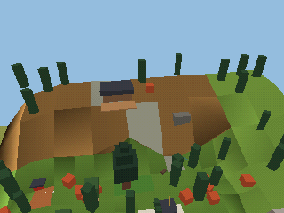
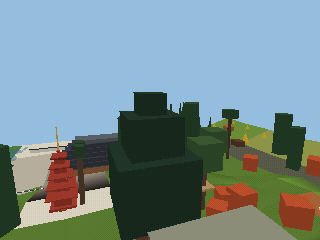

# The shrine town

A temple town of the 1990s wrapped round a shrine and its forested back mountain: a station
plaza and a covered shopping street up to a great torii, back alleys, a canal with machiya and a
sento, a park, a schoolyard, cemetery terraces and a railway viaduct round the south and east;
then the shrine (courtyard, terraced precinct, ridge and pagoda, the west woods' treetop walkway,
the sacred cedar's basin, the fox grove's torii tunnel, the back mountain's stage, falls and
chimney). 320 × 384 m, 30 cells of 64 m, five stars. The design, and every change the building
made to it, is [DESIGN.md](DESIGN.md); the plan in numbers is `layout.py`. How the textures fit
in VRAM (two regions, `town` and `shrine`, split at z = 128; each zone's allowance; the cuts the
town needs) is [TEXTURES.md](TEXTURES.md).

 

## What is built

**A grey box** (DESIGN.md, section 9, phase 1): every building and roof a box at its final
footprint, height and collision, in flat colours, the trees boxes, the rails paths. It is the world `shrinetown`, the movement garden's third (`../world/garden.game.mochi`:
`worlds garden, shrine, shrinetown`), on the garden's controller and camera.

**The game** (DESIGN.md, section 9, phase 2; 12.5): the five stars (the hanafuda moon card), the
red coins releasing star 2, the stage bell, the last train (the omamori's 85 s clock, the train
on track 2, the platform), the shortcuts A–E (triggers that switch their layers, saved), and
ladders A and E held on their front. The entities are in `game.py`; how the cart plays them is
`../README.md`, "Entities" and "Goals".

**Getting in.** Walk into the road works at the west end of the shrine's road (the shrine is
the garden's second world: the torii at the foot of the garden's shrine hill): the road goes on
into the shrine town, to the spawn in the station plaza. The shrine town's konbini door leads to
the garden; its road works at the front road's west end lead back to the shrine. A picture
without playing (the world is built with the garden cart):

```sh
make B=build-mine build-mine/carts/garden.mei
B=build-mine python3 carts/garden/shrinetown/tools/shots.py spawn               # screenshots/spawn.png
B=build-mine python3 carts/garden/shrinetown/tools/shots.py --at 160 1.6 20 0 3 here   # any view
B=build-mine python3 carts/garden/shrinetown/tools/shots.py --night wall_north  # palette variant 1
```

The pictures are drawn as the game draws them, with the region's sky and silhouette behind;
`--out DIR` writes them elsewhere. `screenshots/far/before/` and `after/` are the far views
before and after the stand-ins' cards, haze and later levels (DESIGN.md 12.7).

**The ground.** One heightfield over the level at 2 m, from the three regions' heights files
(`shrinetown.heights.txt`), with cliffs for the canal (z 0–292), the school pool, the culvert,
the precinct's terrace and the temple's podium, the cemetery's nine terraces, the mountain's
flats (the ledge at 44, the ladder's shelf at 24, the pool's terrace at 16, the cave at 14, the
falls' top at 52) and the rims; water for the canal, the pool, the culvert, the pond and the
falls' pool; the trails, the stream, the stairs and the bridges as paths.

**The frame.** No jump or glide leaves the level. The rule (DESIGN.md 12.9, "The level's
frame"): the frame stands 6.6 m over any floor within 4 m of it, less 1 m for every 4 m farther
(a backflip and a ledge grab reach 6.55 m; a glide sinks 1 m in 4 from 4.5 m over the floor it
left, so the mountain's plateau, 62–70 m, reaches every rim north of the town). South of the
viaduct, east of the school, the front road and the cemetery's foot, and west of the machiya and
the front road stand the backs of the neighbours' buildings (20–39 m, placeholders until those
levels exist), with
the edge fences (3 m) and the road works' hoardings (5.5 m) in front of them; the viaduct ends
after the underpass at a concrete wall across its deck (z 126.6). North of the town
rock walls stand on the rims to the rule's heights: 14.5 m at the park rising to 53.5 m in the
north-west, 38 m at the cemetery rising to 70.5 m in the north-east, 57.5–72 m along the north
(`assets/edge_rock`, placed by `place/art.py`). `tools/frame.py` checks a
built world against the rule and writes the frame scenarios' probes. The road's east end under
the viaduct is the seamless edge to downtown (DESIGN.md 7.1), road works until downtown exists.

**Tests.** `carts/garden/tests/shrinetown_cases.akr`, scenarios 400–446, run by `check.sh`
(`make test-carts`), each on the default tuning:

| Scenario | What it proves |
|---|---|
| 400 | The spawn faces north; running north reaches the front road in 10 s (z 115.8) and the great torii at 10.9 s |
| 401 | From the spawn through the ticket gates and up the station's inside stair onto the island platform (10.0) |
| 410–418 | Each glide G1–G9: jump, chained jump held through its apex, glide, land at its target (G5 on roof 1 at 21.3; G6 on roof 3; G7 on the cemetery's top terrace at x 263; G8 in the arcade at z 80) |
| 420 | The kick pair: four good kicks between the cedars (13.6 m), a fifth drifting east, onto the pagoda's roof 4 |
| 421 | The kick chimney: nine kicks from the terrace (16) to the cliff top (46) |
| 422 | The pagoda: from the lantern each roof's eave is 3.6 m up, five chained jumps and grabs, the dew basin, the finial pole, star 1 |
| 423 | The rope from the rope deck into the knot hole (8.9 s), the sill, down the hollow trunk to star 4 |
| 424 | Rope ladder A: the shelf (24) to the ledge (44), 6.1 s up, let go and catch the lip |
| 430 | All 105 coins and red coins: 79 on floors, 26 over rails, each taken there; the 8 red coins |
| 431–433 | The doors: konbini → garden, road works → shrine, the shrine's road works → shrine town |
| 440–446 | The views V1–V6 in the game, and turning round on the pagoda: no late frame |
| 450 | The eighth red coin brings star 2 down onto the great torii's top beam; taken there |
| 451 | The bell's rope (within 0.6 m) rings star 3 down onto the deck; taken |
| 452 | The last train won: the omamori, a glide down the G8 line, the shotengai, the station stair: the platform at 47.1 s; star 5 |
| 453 | The last train lost: the clock runs out at 85 s, the omamori comes back, the train comes in at 60 s, stands from 70, leaves at 85 and parks |
| 454 | The walking route (the torii tunnel, the woods trail, the front road, the shotengai): the platform at 60.6 s, and the clock leaves it its margin |
| 460–464 | Shortcuts A–E: a jump opens nothing; B (A, B, E) or a ground pound (C, D) opens it, saved; still open when the world is opened again |
| 465, 466 | The progress on a memory card: written (shortcut E, star 4), then read at start-up |
| 467 | Ladders A and E: not grabbed while up; held on the front, not gone round |
| 580 | The frame: the 29 ways out the alpha review found (cemetery terraces, under and on the viaduct's end, its parapet rails, the west hoarding, the canal's spring, the path-out torii, the brewery's roof), each closed (`frame_cases.akr`) |
| 581–584 | The frame, south, north, west and east: every 8 m of edge a walk, a backflip and a glide (`frame_probes.akr`, from `tools/frame.py --probes`); no probe leaves the level |

```sh
make B=build-mine build-mine/carts/garden.mei
WORLDS=build-mine/cart-worlds/garden MEIC=build-mine/meic RUN=build-mine/mei-headless \
  carts/garden/tests/run.sh 422 2400 build-mine/s422        # one scenario; SHOT=1 SEQ=10 for frames
```

## What it costs

The World Checker, full (600 sampled views, depth mode, report), the whole level: peak **1,808
triangles, 410,083 draw CPU cycles, 584,668 GPU cycles** (budgets 4,000 / 600,000 / 1,600,000);
before the stand-ins were capped, 3,116 / 593,006 / 647,334. 44 hard failures, all collision
cracks of the kind the shrine has (gaps of 0.02–0.25 m where sweeps, bridge ends and steep
banks meet floors; two on seams). 6.96 MB pack, 165 entities, 2,141 meshes.

**Stand-ins** (DESIGN.md 12.1): capped at 90 a town cell, 140 the landmark cells and 60 the
rest, the ground on a 32 m grid: 28–140 triangles a cell, 2,204 in all (uncapped: 66–520,
7,918).

**The worst views** (`tools/views.py`, the checker at fixed cameras, every row present):

| View | Triangles | Draw CPU | GPU | Placements | Stand-ins | Uncapped: triangles / CPU |
|---|---|---|---|---|---|---|
| V1 arcade roof, north end, looking south | 1,585 | 370,877 | 495,810 | 91 | 0 | 1,585 / 372,176 |
| V2 pagoda top (47) looking south | 756 | 160,952 | 278,176 | 34 | 9 | 1,916 / 296,118 |
| V2 at the spec's 52, looking south | 673 | 147,966 | 259,354 | 29 | 9 | 1,863 / 284,666 |
| V3 stage looking south | 982 | 236,209 | 262,988 | 65 | 10 | 1,914 / 354,925 |
| V4 danchi roof looking north-east | 1,439 | 357,298 | 422,612 | 110 | 12 | 2,545 / 503,607 |
| V5 spawn looking north | 995 | 341,884 | 329,076 | 95 | 10 | 1,689 / 447,534 |
| V6 cemetery top looking west | 1,098 | 280,529 | 357,060 | 70 | 11 | 1,911 / 402,896 |
| Platform looking north | 1,522 | 471,523 | 383,869 | 129 | 10 | 2,431 / 605,417 |
| Deck 3 looking east | 1,522 | 333,973 | 369,218 | 95 | 13 | 2,740 / 491,810 |
| Shoulder top looking south-west (the whole level) | 1,385 | 323,632 | 377,227 | 99 | 12 | 2,328 / 455,149 |

The town's boxes carry the triangle budgets of the assets that will replace them (spec 8.2);
the shrine's and the mountain's are plain boxes, cheaper than the real buildings and trees, so
V2 and V3 will rise with real assets (the spec's estimates: V2 3,700–3,900, V3 3,500, with the
far pass at the caps). With the far ring of three, the spawn's view draws no row beyond row 3:
not the pagoda, not the stage (DESIGN.md 12.4).

## How it is made

Generated, nothing hand-edited. Each region's generator writes its cells, its grey-box recipes
and its world-level part; `make_world.py` joins the parts into the world:

```sh
python3 carts/garden/shrinetown/game.py                               # assets/game (the train, the omamori)
python3 carts/garden/shrinetown/notes/gen_town.py                     # cells c*_0, c*_1; assets/greybox/town
python3 carts/garden/shrinetown/assets/greybox/core/gen_core.py         # cells c*_2, c*_3; assets/greybox/core
python3 carts/garden/shrinetown/assets/greybox/mountain/make_mountain.py   # cells c*_4, c*_5; assets/greybox/mountain
python3 carts/garden/shrinetown/make_world.py                         # shrinetown.world.json, shrinetown.heights.txt
python3 carts/garden/shrinetown/tools/draw.py                         # design/*.png from layout.py
B=build-mine python3 carts/garden/shrinetown/tools/views.py             # the worst views, as a table
python3 carts/garden/shrinetown/tools/textures.py                     # texture bytes by region and zone
python3 carts/garden/shrinetown/tools/frame.py --build-dir build-mine  # the frame against its rule
python3 carts/garden/shrinetown/tools/frame.py --build-dir build-mine --tops --probes   # the rims' tops; the probes
```

All of them read `layout.py`; the three region generators also put `game.py`'s entities (the
stars, the triggers, the train) into their cells, then call the placement zones' hook
(`place/__init__.py`: `apply(STAGE, globals())`, one `place/ZONE.py` per zone, in the order
station, street, east, canal, shrine), which swaps grey boxes for the real assets; a grey-box
recipe nothing places any more is not written. The world's assets are the town's grey boxes
(`assets/greybox/town`) and, through the World Kit's `asset_dirs`, the core's and the mountain's
grey boxes, `assets/*` (a folder per real asset, `assets/game` and `assets/arch_pagoda`, the real
pagoda's climbing collision, among them) and the shrine's `../shrine/assets`. `notes/` keeps each
region's notes from the parallel build (their test worlds are gone: the level is built only as
`shrinetown`).

## Open

- The far ring from the spawn, the pagoda's height from the spawn and G5 (DESIGN.md 12.4).
- The 44 cracks (above), where sweeps, bridge ends and 2 m banks meet: the shrine accepted 44 of
  the same kind. Overlapping three sweeps into what they meet (the walkway stair, the north stair,
  ladder A's steps) closed an edge mismatch but only moved their cracks; the scenarios walk over
  all three.
- Phase 3 on: the real assets, life, textures (DESIGN.md 9). All five zones are placed (DESIGN.md
  12.6); the costs in "What it costs" above are the grey box's (the join's are in 12.6, "The join").
- The texture regions' boundary is not a hidden seam, and the planned assets need more 4-bit
  palettes than a world has unless their 8-bit textures go (TEXTURES.md).
