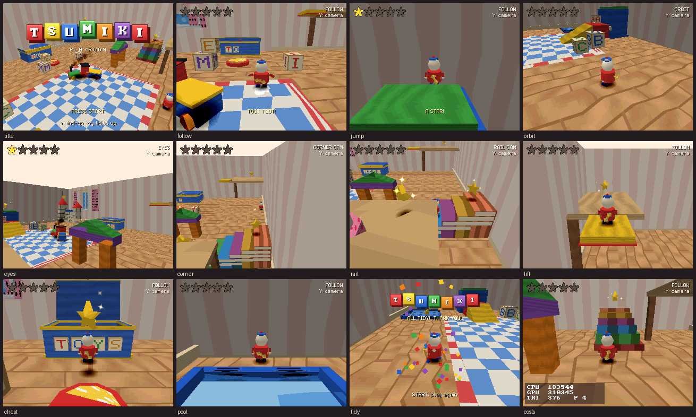
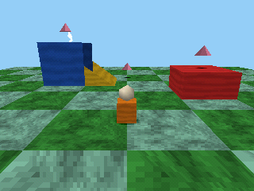

# Tsumiki (積み木)

**A box of wooden blocks for building 3D toys on Mei.**

Tsumiki is a small 3D toolkit in the standard library. With it you can build a level from blocks
and ramps, drop in a toy that runs and jumps, point a camera at it, and add spinning things,
moving platforms, puffs of dust and confetti. A whole playable scene is about 50 lines.

This booklet is all you need. Read **Before you begin** and the **Quickstart**, then look things
up in the **Reference** as you go. **Costs** says how much fits in a frame, and **Care
instructions** lists the usual mistakes.



*The Playroom (`carts/playroom`) is built only with Tsumiki.*

## Contents

1. [What's in the box](#whats-in-the-box)
2. [Before you begin](#before-you-begin)
3. [Quickstart: a garden in 50 lines](#quickstart-a-garden-in-50-lines)
4. [How a frame goes](#how-a-frame-goes)
5. [Recipes](#recipes): [a platformer](#a-platformer), [a top-down adventure](#a-top-down-adventure),
   [a first-person walk](#a-first-person-walk), [a spinning collectible](#a-spinning-collectible),
   [a door that opens](#a-door-that-opens)
6. [Reference](#reference): [the toy box](#the-toy-box-scene), [shapes](#shapes),
   [paint and cells](#paint-and-texture-cells), [solids and queries](#solids-and-queries),
   [bodies](#bodies-the-character-controller), [animation](#animation), [morphs](#morphs),
   [particles](#particles), [cameras](#cameras), [helpers](#helpers-and-the-logo)
7. [The toy file (`tools/tsumiki.py`)](#the-toy-file-toolstsumikipy)
8. [Costs and budgets](#costs-and-budgets)
9. [Care instructions (pitfalls)](#care-instructions-pitfalls)

## What's in the box

| Part | File | What it does |
|---|---|---|
| The toy box | `stdlib/tsumiki/scene.akr` | `tk_open`, the level, platforms, zones, props, `tk_update`, `tk_draw` |
| Shapes | `stdlib/tsumiki/shapes.akr` | box, ramp, cylinder, cone, sphere, grid, checker, wall, terrain |
| Paint | `stdlib/tsumiki/base.akr`, `atlas.akr` | toy colours, texture cells, the light, angle and placing helpers |
| Solids | `stdlib/tsumiki/collide.akr` | shape tests, raycasts, overlaps, floors |
| Bodies | `stdlib/tsumiki/body.akr` | the character controller |
| Animation | `stdlib/tsumiki/anim.akr` | models made of rigid parts, keyframed clips, cross-fades |
| Morphs | `stdlib/tsumiki/morph.akr` | meshes whose vertices move: poses and waves |
| Particles | `stdlib/tsumiki/particles.akr` | puffs, sparkles, smoke, splashes, fire, confetti |
| Cameras | `stdlib/tsumiki/camera.akr` | follow, orbit, first person, fixed, rail; blending; shake |
| Logo | `stdlib/tsumiki/logo.akr` | the TSUMIKI title in blocks |
| Toy builder | `tools/tsumiki.py` | models, rigs, clips, morphs and texture cells from a `.toy` file |

Tsumiki is not in the prelude. A cart that wants it writes `import "tsumiki.akr"`; other carts
don't pay a byte for it.

## Before you begin

- **Names.** Functions and variables start with `tk_`, types with `Tk`, constants with `TK_`.
  Names starting with `__tk_` belong to the toolkit.
- **The world.** +X is right (east), +Y up, +Z forward (north). A yaw of 0 faces +Z; a positive
  yaw turns toward +X. Angles are radians. This is the same as `camera()` (`LANGUAGE.md`).
- **Size.** One unit is about the height of a toy (a body is 0.9 tall). Keep levels within about
  ±90 units of the origin: fixed point overflows a dot product past about 180.
- **Time.** Everything moves per frame (60 a second): speeds are units per frame, gravity is
  units per frame per frame.
- **Things come from pools.** `tk_new_body()`, `tk_new_prop()` and friends hand out a pointer
  into a pool the toolkit owns. Keep the pointer (`var hero: *TkBody`), set its fields through it
  (`hero.speed = 0.1`), and never copy the struct (`var b = *hero` makes a copy that nothing moves).
- **`tk_open()` first.** It empties every pool and loads the built-in textures. Call it in
  `init()` before anything else; pointers you held before it are no longer yours.
- **Fixed point.** Every number is 16.16 `fixed` or an integer; everything is deterministic, so
  the same pad input always plays out the same way.

## Quickstart: a garden in 50 lines

```
cart "Block Garden"
import "tsumiki.akr"

var hero: *TkBody
var gems: [3]*TkProp
const SPOTS: [3]vec3 = [vec3(3.0, 1.6, 2.0), vec3(-3.0, 2.6, 4.0), vec3(0.0, 0.6, 5.0)]

fn init() {
    tk_open(TK_SKY)
    tk_ground_begin()                                   // the ground: drawn under everything
    tk_paint(TK_GREEN, TK_FELT)
    tk_checker(vec3(-10.0, 0.0, -10.0), vec3(10.0, 0.0, 10.0), 10, 10, TK_MINT)
    tk_ground_end()
    tk_level_begin()                                    // blocks: drawn, and solid
    tk_paint(TK_RED, TK_WOOD)
    tk_box(vec3(2.0, 0.0, 1.0), vec3(4.0, 1.0, 3.0))
    tk_paint(TK_YELLOW, TK_WOOD)
    tk_ramp(vec3(-2.0, 0.0, 3.0), vec3(-0.6, 1.0, 5.0), TK_WEST)
    tk_paint(TK_BLUE, TK_WOOD)
    tk_box(vec3(-4.0, 0.0, 3.0), vec3(-2.0, 2.0, 5.0))
    tk_level_end()
    tk_shape_begin()                                    // the player's toy: a block and a ball
    tk_paint(TK_ORANGE, TK_WOOD)
    tk_box(vec3(-0.25, 0.0, -0.2), vec3(0.25, 0.55, 0.2))
    tk_paint(TK_CREAM, TK_PLAIN)
    tk_smooth(true)
    tk_sphere(vec3(0.0, 0.75, 0.0), 0.22, 3)
    hero = tk_new_body(vec3(0.0, 0.0, -4.0))
    hero.mesh = tk_shape_end()
    tk_shape_begin()                                    // a gem to find
    tk_paint(TK_PINK, TK_PLAIN)
    tk_cone(vec3(0.0, 0.0, 0.0), 0.3, 0.4, 6)
    let gem = tk_shape_end()
    for i in 0..3 {
        gems[i] = tk_new_prop(gem, SPOTS[i])            // props: drawn by tk_draw()
        gems[i].spin = 0.05
        gems[i].bob = 0.1
        gems[i].shadow = 0.25
    }
    let _ = tk_new_emitter(TK_FIRE, vec3(-3.0, 2.1, 4.6))
    tk_cam_follow(hero, 0)
}

fn update() {
    tk_drive_pad(hero)                                  // stick or d-pad runs, A jumps
    tk_update()                                         // everything moves
    for i in 0..3 {
        if gems[i].shown && tk_body_touches(hero, tk_prop_spot(gems[i]), 0.4) {
            gems[i].shown = false
            tk_burst(TK_SPARKLE, gems[i].pos, 20)
            println("a gem!")
        }
    }
}

fn draw() { tk_draw() }
```



What each piece does:

1. **`tk_open(TK_SKY)`** empties the toy box and clears the screen to sky blue each frame.
2. **Ground** (`tk_ground_begin` .. `tk_ground_end`): shapes that lie flat on the floor. They are
   drawn before everything else, so nothing standing on them can sort under them. They are solid.
3. **Level** (`tk_level_begin` .. `tk_level_end`): blocks, ramps and the rest. Drawn every frame
   and solid: bodies stand on them and bump into them.
4. **Shapes** (`tk_shape_begin` .. `tk_shape_end`): a mesh to use as you like, here the
   player's toy and a gem. Not solid.
5. **`tk_paint(colour, finish)`** is the brush for the shapes after it: a toy colour and a
   finish (`TK_WOOD` grain, `TK_FELT`, `TK_PLAIN`, ...).
6. **A body** (`tk_new_body`) is the character controller; give it a mesh (or an animation) and
   `tk_draw()` draws it, with a blob shadow and squash and stretch.
7. **Props** (`tk_new_prop`) are meshes that spin and bob; `tk_draw()` draws them too.
8. **`tk_drive_pad(hero)`** reads the pad, relative to the camera. **`tk_update()`** moves
   everything. **`tk_draw()`** draws everything.

The same file is `tests/lang/tsumiki_quickstart.akr`, so it always builds.

## How a frame goes

```
update():   read input → tk_drive(...) / tk_drive_pad(...) → your choices (tk_play, ...)
            → tk_update() → react to what happened (b.landed, tk_zone_entered, ...)
draw():     tk_draw() → your own extra drawing (morph meshes, HUD text)
```

`tk_update()` steps, in order: platforms (so they carry what stands on them), bodies (and the
clips they choose), zones, animations, particles and emitters, props' spin and bob, and the
camera. `tk_draw()` clears to the sky colour, points the camera (with its shake), draws the
ground pieces (flushed at once, piece by piece), the level pieces that are on screen,
platforms, props, bodies, blob shadows and particles, all sorted in the ordering table. Call
`tk_draw()` **first** in `draw()`: the ground is drawn the moment it runs, so anything sorted
before it would end up under the ground.

## Recipes

Each recipe is a whole cart. They are also lang tests (`tests/lang/tsumiki_recipe_*.akr`), with
a few lines of scripted input below the recipe.

### A platformer

Stepping stones, a raft that drifts across a gap, a spring pad and falling back to the start.

```
cart "Hop"
import "tsumiki.akr"

const START: vec3 = vec3(0.0, 0.5, -1.0)
var hero: *TkBody
var spring: *TkZone

fn init() {
    tk_open(TK_SKY)
    tk_level_begin()
    for i in 0..6 {                                     // stepping stones, each a little higher
        let z = fixed(i) * 2.4
        tk_paint(TK_TOY_COLOURS[i], TK_WOOD)
        tk_box(vec3(-1.0, 0.0, z - 2.0), vec3(1.0, 0.5 + fixed(i) * 0.35, z - 0.4))
    }
    tk_paint(TK_RED, TK_PLAIN)                          // a spring pad on the last one
    tk_smooth(true)
    tk_cylinder(vec3(0.0, 2.25, 11.2), 0.6, 0.1, 10)
    tk_level_end()
    spring = tk_new_zone(vec3(-0.6, 2.25, 10.6), vec3(0.6, 2.6, 11.8))
    tk_shape_begin()                                    // a platform drifting across the gap
    tk_paint(TK_YELLOW, TK_WOOD)
    tk_box(vec3(-1.0, -0.3, -1.0), vec3(1.0, 0.0, 1.0))
    let raft = tk_new_platform(tk_shape_end(), vec3(-4.0, 4.0, 15.0), vec3(-1.0, -0.3, -1.0), vec3(1.0, 0.0, 1.0))
    tk_platform_path(raft, vec3(-4.0, 4.0, 15.0), vec3(4.0, 4.0, 15.0), 150)
    tk_shape_begin()
    tk_paint(TK_BLUE, TK_PLAIN)
    tk_smooth(true)
    tk_cylinder(vec3(0.0, 0.0, 0.0), 0.25, 0.6, 8)
    tk_sphere(vec3(0.0, 0.8, 0.0), 0.22, 3)
    hero = tk_new_body(START)
    hero.mesh = tk_shape_end()
    tk_cam_follow(hero, 0)
}

fn update() {
    tk_drive_pad(hero)
    tk_update()
    if tk_zone_entered(spring) {                        // boing: a jump far higher than its own
        tk_launch(hero, vec3(0.0, 0.32, 0.02))
        tk_burst(TK_DUST, hero.pos, 8)
        tk_shake(0.2, 10)
    }
    if hero.pos.y < -6.0 { tk_teleport(hero, START) }   // fell off: back to the start
}

fn draw() { tk_draw() }
```

Tune the jump with the body's fields: `hero.jump` (take-off speed), `hero.gravity`,
`hero.coyote` and `hero.buffer` (frames of grace). Letting go of A early gives a lower jump.

### A top-down adventure

Rolling hills, a camera high above that keeps facing north, a pup that follows you about, and a
signpost that speaks when you come near.

```
cart "Hillside"
import "tsumiki.akr"

var hills: [100]fixed                                   // 10 x 10 corner heights (9 x 9 cells)
var hero: *TkBody
var pup: *TkBody
var sign: *TkZone
var talk: s32                                           // frames left of the sign's message

fn toy(colour: u32, size: fixed) -> *Mesh {
    tk_shape_begin()
    tk_paint(colour, TK_PLAIN)
    tk_smooth(true)
    tk_sphere(vec3(0.0, size, 0.0), size, 3)
    return tk_shape_end()
}

fn init() {
    tk_open(TK_SKY)
    for k in 0..10 {
        for i in 0..10 { hills[k * 10 + i] = sin(fixed(i) * 1.1) * 0.9 + cos(fixed(k) * 0.8) * 0.9 + 1.0 }
    }
    tk_level_begin()
    tk_paint(TK_GREEN, TK_FELT)
    tk_terrain(vec3(-18.0, 0.0, -18.0), 4.0, 9, 9, &hills[0])
    let y = tk_terrain_height(3.6, 0.7)                 // a signpost, standing on the hill
    tk_paint(TK_BEECH, TK_WOOD)
    tk_box(vec3(3.5, y - 0.5, 0.6), vec3(3.8, y + 2.2, 0.9))
    tk_box(vec3(2.9, y + 1.5, 0.5), vec3(4.4, y + 2.1, 0.6))
    tk_level_end()
    sign = tk_new_zone(vec3(2.0, -2.0, -1.0), vec3(5.0, 8.0, 2.5))
    hero = tk_new_body(vec3(0.0, 2.0, 0.0))
    hero.mesh = toy(TK_RED, 0.35)
    pup = tk_new_body(vec3(-2.0, 2.0, -1.0))
    pup.mesh = toy(TK_CREAM, 0.22)
    pup.speed = 0.095                                   // a little faster than the hero
    pup.jump = 0.0                                      // pups don't jump
    tk_cam.dist = 11.0                                  // high above, looking well down,
    tk_cam.tilt = -1.0
    tk_cam.swing = false                                // and always facing north
    tk_cam_follow(hero, 0)
}

fn update() {
    tk_drive_pad(hero)
    let to = vec3(hero.pos.x - pup.pos.x, 0.0, hero.pos.z - pup.pos.z)
    var wish = vec3(0.0, 0.0, 0.0)
    if dot(to, to) > 2.5 { wish = normalize(to) }       // trot after the hero, stopping short
    tk_drive(pup, wish, false)
    tk_update()
    if tk_zone_entered(sign) { talk = 120 }
    if talk > 0 { talk -= 1 }
}

fn draw() {
    tk_draw()
    if talk > 0 { font_text_align(160, 200, "HILLSIDE: MIND THE PUP", TK_WHITE, ALIGN_CENTRE) }
}
```

The heights array must stay valid while the cart runs (a global or `const` data): the terrain
keeps a pointer to it. Any body, not just the player, is driven with `tk_drive()`.

### A first-person walk

A maze of block walls seen through the eyes of a body. `tk_drive_pad()` already does
first-person controls when the camera is in first person: up and down walk, left and right turn,
L and R step sideways.

```
cart "Block Maze"
import "tsumiki.akr"

// the maze, row by row from the south: '#' a wall block, '.' floor, 'E' the way out
const MAZE: [5]*u8 = ["#######", "#.#...#", "#.#.#.#", "#...#.E", "#######"]
const W = 7
const H = 5

var me: *TkBody
var out: *TkZone

fn init() {
    tk_open(TK_SKY)
    tk_fog(TK_SKY, 4.0, 14.0)                           // a misty maze
    tk_ground_begin()
    tk_paint(TK_BEECH, TK_PLANKS)
    tk_grid(vec3(0.0, 0.0, 0.0), vec3(fixed(W) * 2, 0.0, fixed(H) * 2), W, H)
    tk_ground_end()
    tk_level_begin()
    for k in 0..H {
        for i in 0..W {
            let c = MAZE[k][i]
            let lo = vec3(fixed(i) * 2, 0.0, fixed(k) * 2)
            if c == '#' {
                tk_paint(TK_TOY_COLOURS[(i + k) % 6], TK_BRICK)
                tk_box(lo, lo + vec3(2.0, 2.5, 2.0))
            }
            if c == 'E' { out = tk_new_zone(lo, lo + vec3(2.0, 2.0, 2.0)) }
        }
    }
    tk_level_end()
    me = tk_new_body(vec3(3.0, 0.0, 3.0))               // a body with no mesh: just eyes
    me.yaw = 0.0
    tk_cam_first_person(me, 0)
}

fn update() {
    tk_drive_pad(me)                                    // up/down walk, left/right turn, L/R step
    tk_update()
    if tk_zone_entered(out) { println("out of the maze!") }
}

fn draw() { tk_draw() }
```

To look up and down, call `tk_cam_turn(0.0, pitch)` (radians this frame), for example from the
stick's y while a button is held.

### A spinning collectible

A star made by the toy builder that spins, bobs, casts a shadow, glints now and then, bursts
into sparkles when touched and comes back somewhere else. The star comes from a `.toy` file:

```
# stars.toy:  python3 tools/tsumiki.py stars.toy   (writes stars.akr and star.bin)
mesh star
  paint yellow
  star 0 0 0  0.4 0.18 0.16 points 5
```

```
cart "Starry"
import "tsumiki.akr"
import "stars.akr"                                      // STAR

var hero: *TkBody
var star: *TkProp
var score = 0
var away = 0                                            // frames until the star comes back

fn init() {
    tk_open(TK_SKY)
    tk_ground_begin()
    tk_paint(TK_MINT, TK_FELT)
    tk_grid(vec3(-8.0, 0.0, -8.0), vec3(8.0, 0.0, 8.0), 8, 8)
    tk_ground_end()
    tk_shape_begin()
    tk_paint(TK_PURPLE, TK_PLAIN)
    tk_smooth(true)
    tk_cone(vec3(0.0, 0.0, 0.0), 0.35, 0.9, 8)
    hero = tk_new_body(vec3(0.0, 0.0, -3.0))
    hero.mesh = tk_shape_end()
    star = tk_new_prop(STAR, vec3(0.0, 0.8, 1.0))
    star.spin = 0.06                                    // radians a frame
    star.bob = 0.15                                     // up and down this far
    star.shadow = 0.3
    tk_cam_follow(hero, 0)
}

fn update() {
    tk_drive_pad(hero)
    tk_update()
    let at = tk_prop_spot(star)                         // where it is drawn, bob and all
    if star.shown && tk_body_touches(hero, at, 0.45) {
        star.shown = false
        score += 1
        away = 180
        tk_burst(TK_SPARKLE, at, 24)
    }
    if star.shown && tk_ticks() % 25 == 0 { tk_burst(TK_SPARKLE, at, 2) }   // a glint now and then
    if away > 0 {
        away -= 1
        if away == 0 {
            star.pos = vec3(tk_rand_signed() * 6.0, 0.8, tk_rand_signed() * 6.0)
            star.shown = true
        }
    }
}

fn draw() {
    tk_draw()
    tk_sprite(TK_STAR, 8, 8, 16, 16, TK_YELLOW, BLEND_NONE)
    text_int(28, 12, score, TK_WHITE)
}
```

### A door that opens

A button on the floor (a zone) opens a door for a while. The door is a platform that the cart
moves itself with `tk_platform_move()`, so it is solid wherever it is.

```
cart "Door"
import "tsumiki.akr"

const SHUT: vec3 = vec3(0.0, 0.0, 6.0)
var hero: *TkBody
var door: *TkPlatform
var button: *TkZone
var open_for = 0                                        // frames the door stays open
var opening: fixed                                      // 0 shut .. 1.0 open

fn init() {
    tk_open(TK_SKY)
    tk_ground_begin()
    tk_paint(TK_BEECH, TK_PLANKS)
    tk_grid(vec3(-6.0, 0.0, -4.0), vec3(6.0, 0.0, 12.0), 6, 8)
    tk_ground_end()
    tk_level_begin()
    tk_paint(TK_CREAM, TK_BRICK)                        // a wall with a doorway
    tk_box(vec3(-6.0, 0.0, 5.8), vec3(-1.0, 3.0, 6.2))
    tk_box(vec3(1.0, 0.0, 5.8), vec3(6.0, 3.0, 6.2))
    tk_box(vec3(-1.0, 2.4, 5.8), vec3(1.0, 3.0, 6.2))
    tk_solid(false)                                     // a button to step on
    tk_paint(TK_RED, TK_PLAIN)
    tk_cylinder(vec3(0.0, 0.0, 2.0), 0.5, 0.06, 10)
    tk_level_end()
    button = tk_new_zone(vec3(-0.5, 0.0, 1.5), vec3(0.5, 0.5, 2.5))
    tk_shape_begin()                                    // the door: a platform we move ourselves
    tk_paint(TK_WALNUT, TK_WOOD)
    tk_box(vec3(-1.0, 0.0, -0.15), vec3(1.0, 2.4, 0.15))
    door = tk_new_platform(tk_shape_end(), SHUT, vec3(-1.0, 0.0, -0.15), vec3(1.0, 2.4, 0.15))
    tk_shape_begin()
    tk_paint(TK_BLUE, TK_WOOD)
    tk_box(vec3(-0.25, 0.0, -0.25), vec3(0.25, 0.8, 0.25))
    hero = tk_new_body(vec3(0.0, 0.0, -2.0))
    hero.mesh = tk_shape_end()
    tk_cam_follow(hero, 0)
}

fn update() {
    tk_drive_pad(hero)
    if tk_zone_entered(button) {
        open_for = 240
        tk_shake(0.1, 8)
    }
    if open_for > 0 { open_for -= 1 }
    var want: fixed = 0.0
    if open_for > 0 { want = 1.0 }
    opening = tk_approach(opening, want, 0.025)
    tk_platform_move(door, SHUT + vec3(0.0, tk_ease(opening) * 2.3, 0.0))   // up into the wall
    tk_update()
}

fn draw() { tk_draw() }
```

The zone sees every body: `tk_zone_has(button, hero)` asks about one. A door can also be a
solid switched off with `tk_solid_on(i, false)`, with a prop drawn where it was.

## Reference

Pool sizes: 16 bodies, 16 animations, 16 morphs, 16 emitters, 256 particles, 256 solids,
64 level pieces (chunks), 8 platforms, 16 zones, 32 props, 16 parts a rig, 1,024 faces and
2,048 vertices a shape, 128 KB of shape bin. A `tk_new_*` past its pool's end prints a message
and returns `null`.

### The toy box (`scene.akr`)

| | |
|---|---|
| `tk_open(sky: u32)` | empty the toy box: pools, solids, terrain, level, shape bin, particle styles (back to the presets), camera (back to its defaults), light; load the built-in cells; set the clear colour and `camera_clip(0.1, 64.0)` |
| `tk_no_sky()` | don't clear the screen (a cart with its own sky, or the plane chip). Only safe when the scene always covers the screen |
| `tk_fog(colour, near, far)` | fog everything `tk_draw()` draws |
| `tk_level_begin()`, `tk_level_end()` | build a level piece: drawn every frame, sorted, solid (`tk_solid(false)` for parts to walk through) |
| `tk_ground_begin()`, `tk_ground_end()` | build a ground piece: like a level piece, drawn before everything else (in the order they were made) |
| `tk_add_piece(m: *Mesh, ground: bool)` | add a mesh made elsewhere (the toy builder) to the level; not solid |
| `tk_update()` | one frame of everything (see [How a frame goes](#how-a-frame-goes)) |
| `tk_draw()` | draw everything; call it first in `draw()` |
| `tk_ticks() -> s32` | frames `tk_update()` has run since `tk_open()` |
| `tk_drive_pad(b: *TkBody)` | drive `b` from controller 1, to suit the camera mode (below) |
| `weak fn tk_input_pad() -> u32`, `weak fn tk_input_stick() -> vec2` | what `tk_drive_pad()` reads: `PAD1` and `stick()`. Define your own to script the player (tests) |
| `tk_shadow(p: vec3, r: fixed)` | a blob shadow on the floor under `p` (bodies and props get theirs from `tk_draw()`) |
| `tk_mesh_reach(m) -> fixed` | how far a mesh's vertices reach from its origin |

Level and ground pieces are cut into chunks of about 8 × 8 units (by where each face's middle
is), and `tk_draw()` skips the chunks that are off screen.

**`tk_drive_pad()` by camera mode.** Follow, fixed and rail: stick or d-pad runs (up runs away
from the camera), A jumps, L and R turn a follow camera. Orbit: the d-pad runs, the stick
orbits the camera, A jumps. First person: up and down walk, left and right turn, L and R step
sideways, A jumps.

**Platforms.** A platform is a mesh with a block collider that carries whatever stands on it.

| | |
|---|---|
| `tk_new_platform(mesh, pos, lo, hi) -> *TkPlatform` | `mesh` drawn at `pos` (null: an invisible one), solid over `pos + lo .. pos + hi` |
| `tk_platform_path(p, a, b, frames)` | to and fro between `a` and `b`, easing, `frames` each way, resting `p.pause` (30) at each end |
| `tk_platform_move(p, pos)` | put it at `pos` in the next step (moves what stands on it); stops its path |

Fields: `pos`, `delta` (the last step's move), `mesh`, `solid` (its collider's number), `lo`, `hi`,
`a`, `b`, `frames`, `pause`, `moving`.

**Zones.** A zone is a box that notices bodies.

| | |
|---|---|
| `tk_new_zone(lo, hi) -> *TkZone` | a zone over `lo .. hi` |
| `tk_zone_entered(z) -> bool`, `tk_zone_left(z) -> bool` | a body came in / went out in the last step |
| `tk_zone_has(z, b) -> bool`, `tk_zone_count(z) -> s32` | is body `b` in it; how many bodies are |

Fields: `lo`, `hi`, `on` (false: it notices nothing).

**Props.** A prop is a mesh (or an animation) placed in the toy box, drawn by `tk_draw()` when
`shown`, skipped when off screen.

| | |
|---|---|
| `tk_new_prop(mesh, pos) -> *TkProp` | a prop of `mesh` at `pos` (set `anim` to show an animation instead) |
| `tk_prop_spot(p) -> vec3` | where it is drawn this frame, its bob added |

Fields: `pos`, `yaw`, `scale` (1.0), `spin` (radians a frame), `bob` (units), `bob_speed`
(0.06 radians a frame), `mesh`, `anim`, `shadow` (radius; 0 none), `shown` (true).

### Shapes (`shapes.akr`)

Shapes are built between `tk_shape_begin()` and `tk_shape_end()` (or a level's or ground's
begin and end). They are lit when they are built, by the light (`tk_light`): a block's top,
front and sides come out in different shades of its paint.

| | |
|---|---|
| `tk_shape_begin()` | start a mesh; resets the brush (white, plain, flat-lit, opaque, one-sided, solid). One begin .. end holds at most 1,024 faces and 2,048 vertices: build a big level in several `tk_level_begin()` .. `tk_level_end()` |
| `tk_shape_end() -> *Mesh` | finish it; the mesh lives in the shape bin until `tk_open()` |
| `tk_box(lo, hi)` | a block from corner `lo` to corner `hi` (smaller x, y, z to larger). In a level, a block standing on y = 0 or on another block leaves out its hidden bottom |
| `tk_ramp(lo, hi, dir)` | a wedge filling `lo .. hi`, its slope rising from `lo.y` to `hi.y` toward `dir`: `TK_EAST` (+X), `TK_WEST`, `TK_NORTH` (+Z), `TK_SOUTH` |
| `tk_cylinder(base, r, h, sides)` | standing on `base` (the middle of its bottom); 3-32 sides |
| `tk_cone(base, r, h, sides)` | standing on `base`, its point `h` above |
| `tk_sphere(centre, r, rings)` | `rings` bands pole to pole (2-8), twice as many round; best smooth |
| `tk_grid(lo, hi, nx, nz)` | a floor at `lo.y` from (`lo.x`, `lo.z`) to (`hi.x`, `hi.z`) in `nx × nz` tiles, each showing the whole finish cell |
| `tk_checker(lo, hi, nx, nz, other)` | the same, tiles alternating the brush colour and `other` |
| `tk_wall(lo, hi, nx, ny, facing)` | an upright grid from `lo` to `hi` (which share an x or a z), facing `TK_EAST` ... `TK_SOUTH`; never solid |
| `tk_terrain(origin, cell, nx, nz, heights: *fixed)` | rolling ground: `nx × nz` cells (two faces each, so at most 512 in one begin .. end), `(nx + 1) × (nz + 1)` heights row by row along x, rows going +Z, added to `origin.y`; always smooth-lit. In a level it is the toy box's terrain (one per toy box) |

**The brush** keeps every setting until it changes or a new shape begins:

| | |
|---|---|
| `tk_paint(colour, finish)` | the colour (`0xBBGGRR`) and finish (`TK_PLAIN` or a texture cell) of the following faces |
| `tk_smooth(on)` | Gouraud lighting by corner (round things look round); off: one shade a face |
| `tk_blend(mode)` | semi-transparent faces: `BLEND_HALF`, `BLEND_ADD`, `BLEND_SUB`, `BLEND_QUARTER`; `BLEND_NONE` |
| `tk_two_sided(on)` | faces seen from both sides (flags, paper, leaves) |
| `tk_solid(on)` | in a level: whether the following shapes are solid (true) |
| `tk_light(from: vec3, ambient)` | the light of shapes built from now on: the direction it comes from and the ambient 0..1 (default about (-0.4, 0.85, -0.35), 0.45: from above, in front, a little left) |

In a level, shapes add these solids: a box → a box; a ramp → a ramp; a cylinder → a cylinder;
a cone → a cylinder of 0.7 its radius; a sphere → an upright cylinder around it (so you can
stand on a ball's top); a grid or checker → a slab one unit thick under it; a terrain → the
terrain; a wall → nothing.

### Paint and texture cells

Toy paint (`0xBBGGRR`): `TK_RED`, `TK_ORANGE`, `TK_YELLOW`, `TK_GREEN`, `TK_BLUE`,
`TK_PURPLE`, `TK_PINK`, `TK_CREAM`, `TK_WHITE`, `TK_BLACK`, `TK_BEECH` (bare wood),
`TK_WALNUT` (dark wood), `TK_SKY`, `TK_MINT`, `TK_GREY`. `TK_TOY_COLOURS: [6]u32` holds the six
bright ones (red, orange, yellow, green, blue, purple).

A **cell** is a rectangle of a 4-bit texture with its palette, packed into one `u32`. The
built-in cells are grey, so the paint colour colours them:

| Finishes | Particles and sprites |
|---|---|
| `TK_WOOD` (grain), `TK_PLANKS`, `TK_FELT`, `TK_STRIPES`, `TK_DOTS`, `TK_CHECK`, `TK_BRICK`, `TK_STARS` | `TK_DOT` (soft round), `TK_STAR` (sparkle), `TK_PUFF`, `TK_DROP`, `TK_FLAME`, `TK_SQUARE`, `TK_RING`, `TK_HEART` |

The toy builder makes coloured cells of your own (`cell` in a `.toy` file); paint them with
`TK_WHITE` to show their colours as they are, or with a colour to tint them.

| | |
|---|---|
| `tk_load_atlas(a: *TkAtlas)` | copy a toy builder's texture cells (`&NAME_ATLAS`) into their slot and palettes. Once, in `init()` |
| `tk_sprite(cell, x, y, w, h, colour, mode)` | draw a cell on the interface list, `w × h` pixels, coloured, with a blend mode |
| `tk_cell_page(c)`, `tk_cell_u(c)`, `tk_cell_v(c)`, `tk_cell_w(c)`, `tk_cell_h(c)` | a cell's texture page bits and rectangle |

Tsumiki keeps texture slot 15 rows 192-255 and 4-bit palette 254 for the built-in cells (the
fonts keep rows 0-66 of slot 15 and palette 255). A toy builder's cells use the slot and
palettes its `texture` line gives (slot 0 and palettes from 0 by default).

### Solids and queries (`collide.akr`)

The level is made of **solids**: blocks (axis-aligned boxes), ramps (wedges rising along an
axis), upright cylinders, and at most one terrain (a heightfield floor). These are exact and
cheap in fixed point; arbitrary triangle soup is left out on purpose (its plane tests need wide
products and divisions per triangle, thin triangles lose precision, and it needs a spatial
index to be affordable).

| | |
|---|---|
| `tk_add_box(lo, hi) -> s32`, `tk_add_ramp(lo, hi, dir) -> s32`, `tk_add_cylinder(base, r, h) -> s32` | an invisible solid; returns its number (-1 when 256 are in use) |
| `tk_solid_on(i, on)` | switch a solid on or off |
| `tk_terrain_set(origin, cell, nx, nz, heights)` | an invisible terrain (as `tk_terrain`) |
| `tk_floor_at(x, z, below) -> fixed` | the highest floor at (`x`, `z`) no higher than `below`; `TK_NO_FLOOR` (-1000) if none |
| `tk_terrain_height(x, z) -> fixed` | the terrain's height there, or `TK_NO_FLOOR` |
| `tk_solid_top(i, x, z) -> fixed` | solid `i`'s top at (`x`, `z`): a ramp's slope height |
| `tk_raycast(from, to, hit: *TkHit) -> bool` | the first solid (or the terrain) on the segment `from` → `to` |
| `tk_overlap_sphere(c, r) -> s32`, `tk_overlap_box(lo, hi) -> s32` | the first solid overlapping, or -1 |

`TkHit`: `pos`, `normal`, `t` (0 at `from` .. 1.0 at `to`), `solid` (-1 for the terrain).
`TkSolid`: `lo`, `hi`, `kind` (`TK_SOLID_BOX`, `TK_SOLID_RAMP`, `TK_SOLID_CYLINDER`), `dir`,
`on`, `platform`.

**Shape tests** (no solids involved). A capsule is the segment `a .. b` grown by `r`; a body at
`p` is the capsule `p + (0, r, 0) .. p + (0, height - r, 0)`.

| | |
|---|---|
| `tk_sphere_sphere(a, ra, b, rb)`, `tk_sphere_box(c, r, lo, hi)`, `tk_box_box(alo, ahi, blo, bhi)` | overlaps |
| `tk_capsule_sphere(a, b, r, c, rc)`, `tk_capsule_box(a, b, r, lo, hi)`, `tk_capsule_capsule(a0, a1, ra, b0, b1, rb)` | capsule overlaps (`tk_capsule_box` is within a few hundredths at the box's edges) |
| `tk_ray_box(from, to, lo, hi) -> fixed`, `tk_ray_sphere(from, to, c, r) -> fixed` | where the segment enters: 0..1.0, or -1.0 for a miss (0 when it starts inside) |
| `tk_closest_in_box(lo, hi, p)`, `tk_closest_on_segment(a, b, p)` | nearest points |

### Bodies: the character controller (`body.akr`)

A body is an upright capsule with its feet at `pos`. It walks on block tops, ramps, platforms
and the terrain; falls; jumps with coyote time, a jump buffer and a lower jump when A is let go
early; slides along walls; steps up ledges up to `step` high (and is shown catching up
smoothly); rides moving platforms. Slopes that rise more than `step` across its radius are
walls. No physics simulation: it goes where it is told.

| | |
|---|---|
| `tk_new_body(pos) -> *TkBody` | a body with its feet at `pos` |
| `tk_drive(b, wish: vec3, jump: bool)` | for the next `tk_update()`: run along `wish` (y ignored; length 0..1 is the share of top speed), jump while `jump` is held |
| `tk_teleport(b, pos)` | put it somewhere, standing still |
| `tk_launch(b, vel)` | throw it (springs, knock-backs): sets its velocity and takes it off the ground |
| `tk_body_clips(b, idle, run, air)` | let `tk_update()` choose the body's clips: `idle` standing, `run` moving (faster when running faster), `air` off the ground (`run` or `air` null: the others stand in). Needs `b.anim`. `idle` null stops it choosing |
| `tk_body_touches(b, p, r) -> bool` | does it touch the ball at `p` (collectibles, hazards) |
| `tk_bodies_touch(a, b) -> bool` | do two bodies touch |
| `tk_body_matrix(b) -> mat4` | its model matrix for drawing (feet, yaw, squash and stretch) |

**Tuning fields** (defaults): `radius` 0.28, `height` 0.9, `speed` 0.085 (top running speed),
`accel` 0.2 (share of the way to the wanted velocity each frame, on the ground), `air` 0.07
(the same in the air), `jump` 0.165 (take-off speed; 0: no jumping), `gravity` 0.0085,
`fall_max` 0.32, `step` 0.32, `turn` 0.25 (radians a frame), `coyote` 6 and `buffer` 6 (frames).
With these a held jump goes about 1.5 high; letting go of jump early halves the rising speed, so a tap goes well under half as high.

**State fields** (after each step): `pos`, `vel`, `yaw`, `on_ground`, `landed` (touched down
this step), `jumped` (left the ground by jumping, or `tk_launch`), `bumped` (hit a wall or a
ceiling), `impact` (fall speed at landing), `ground` (the solid stood on; -1 the terrain or
nothing), `moving` (horizontal speed over top speed, 0..1).

**Drawing fields:** `mesh` or `anim` (drawn at `tk_body_matrix`), `shadow` (0.32; 0 none),
`puffs` (true: dust on jumping and landing), `hidden`, `squash` (set it for a squash of your own;
it settles by itself).

### Animation (`anim.akr`)

A **rig** is a tree of rigid parts, each a mesh that turns about its joint. A **clip** gives every
part a rotation and a movement at each key frame, interpolated in a straight line between keys.
Rigs and clips come from the toy builder (`model`, `part`, `clip`, `key`).

| | |
|---|---|
| `tk_new_anim(rig: *TkRig) -> *TkAnim` | an animation of a rig (`&ZENMAI`), in its rest pose |
| `tk_play(a, clip: *TkClip, fade)` | play `clip` (`&ZENMAI_RUN`), cross-fading from what was playing over `fade` frames; the clip already playing is left alone |
| `tk_restart(a, clip, fade)` | play `clip` from its start, even if it is playing |
| `tk_anim_draw(a, model: mat4)` | draw the pose with a model matrix (`tk_place`, `tk_squash`, `tk_body_matrix`) |
| `tk_anim_joint(a, part) -> *TkJoint` | a joint of the sampled pose, to change after `tk_update()` and before drawing (a spinning key, a head that looks) |
| `tk_anim_part_mesh(a, part, mesh)` | draw `mesh` for that part instead (a morph of it, a held toy); null: its own |
| `tk_anim_passed(a, frame) -> bool` | did the last step pass that frame of the clip (footsteps, sounds) |
| `tk_anim_point(a, model, part) -> vec3` | where a part's joint is in the world |
| `tk_joint_matrix(pos, rot) -> mat4` | a joint's matrix (yaw, then pitch, then roll) |

`TkAnim` fields: `rig`, `clip`, `time` (frames into it), `speed` (1.0; 2.0 twice as fast), `done`
(a clip played once has ended), `from`, `fade`, `pose: [16]TkJoint`, `meshes`, `hidden` (bit
`n`: part `n` not drawn). `TkJoint`: `rot` (radians: x swings a hanging limb forward toward +Z,
y turns toward +X, z swings a hanging limb toward +X) and `move`.

Both clips of a cross-fade keep moving while it lasts. A looping clip's last key leads back to
its first. Data types: `TkPart { parent, mesh, joint }`, `TkRig { parts, count }`,
`TkClip { keys, times, nkeys, nparts, length, looping }`.

### Morphs (`morph.akr`)

A morph is a RAM copy of a mesh (in the shape bin) whose vertices the cart reshapes each frame.

| | |
|---|---|
| `tk_new_morph(data: *TkMorphData) -> *TkMorph` | a morph with poses from the toy builder (`&FLAG_MORPH`, `&ZENMAI_HEAD_MORPH`) |
| `tk_new_morph_mesh(m: *Mesh) -> *TkMorph` | a morph of any mesh, its own shape as pose 0: for waves |
| `tk_morph_blend(m, a, b, t)` | shape it between pose `a` and pose `b` (0: `a`, 1.0: `b`; beyond overshoots) |
| `tk_morph_pose(m, p)` | show pose `p` |
| `tk_morph_wave(m, amount: vec3, freq: vec3, phase, pin: vec3)` | each vertex `p` of pose 0 moves by `amount × sin(dot(p, freq) + phase)`, times `clamp(dot(p, pin), 0, 1)` unless `pin` is zero |

Draw `m.mesh` like any mesh (`mesh_at`, `mesh_xf`, a prop's `mesh`, `tk_anim_part_mesh`). Each
call rewrites every vertex, so nothing builds up; one blend or one wave a frame (they don't
combine). Lighting stays as it was built. A flag hanging from its left edge at x = 0 and
reaching to x = 1 waves with `pin = vec3(1.0, 0.0, 0.0)`; water waves with `pin` zero.

### Particles (`particles.akr`)

One pool of 256 particles, drawn as camera-facing quads straight into the ordering table.

| | |
|---|---|
| `tk_burst(style, pos, count)` | start `count` particles at `pos` |
| `tk_burst_moving(style, pos, count, vel)` | the same, `vel` added to each (a splash thrown up, sparks blown sideways) |
| `tk_new_emitter(style, pos) -> *TkEmitter` | a spot that makes particles all the time: `rate` (0.5 a frame), `vel`, `pos`, `on` |
| `tk_style(n) -> *TkStyle` | style `n` (0-15) to change or fill in; 6-15 are free. Start from a preset: `*tk_style(6) = *tk_style(TK_FIRE)` |
| `tk_particle_cap(n)` | the most drawn in one frame (160) |
| `tk_particles_alive()`, `tk_particles_drawn()` | counts |

**Presets:** `TK_DUST` (warm puffs that spread and fade), `TK_SPARKLE` (twinkling stars),
`TK_SMOKE` (dark puffs that rise and grow; subtractive), `TK_SPLASH` (drops thrown up that fall
and land), `TK_FIRE` (flames that rise and shrink, yellow to red), `TK_CONFETTI` (squares of toy
colours that spin, flutter down and lie on the floor).

**`TkStyle` fields** (the defaults of a new style): `life` 30 and `life_jitter` 8 (frames),
`speed` 0.03 (random outward), `flat` 0 (1.0: only sideways), `lift` 0 (upward at birth),
`spread` 0.1 (born this far from the spot), `gravity` 0 (negative rises), `drag` 0.95 (speed
kept each frame), `size0` 0.2 and `size1` 0.1 (world size at birth and death), `col0`, `col1`,
`col2` (colour at birth, half-way, death), `blend` `BLEND_ADD` (or `BLEND_HALF`, `BLEND_SUB`,
`BLEND_QUARTER`, `BLEND_NONE`), `cell` `TK_DOT`, `spin`, `twinkle`, `toy_colours` (each one a
toy colour), `lands` (stops on the floor under where it was born).

**The caps.** The pool is a ring: when 256 are alive a new particle replaces the oldest. At most
64 start in one frame (the rest of a burst is dropped). At most the draw cap are drawn: with
more alive, every second (third, ...) one is drawn, a little bigger, so a crowd thins out
instead of costing more. A particle's half-size on screen is capped at 48 pixels.

### Cameras (`camera.akr`)

One camera, `tk_cam`, in one of five modes. Each mode function takes `blend`: frames to glide
there from where the camera is (0: at once).

| | |
|---|---|
| `tk_cam_follow(b, blend)` | behind `b`, looking down a little; swings round behind it as it runs (unless `swing` is false); pulls in front of solids in the way, or rises to look over them |
| `tk_cam_orbit(b, blend)` | round `b` at `dist`, turned by `tk_cam_turn()` |
| `tk_cam_first_person(b, blend)` | through `b`'s eyes (`eye_height` above its feet); `b` faces where the camera looks and is hidden meanwhile |
| `tk_cam_fixed(eye, b, look, blend)` | standing at `eye`, watching `b` (or the point `look` when `b` is null) |
| `tk_cam_rail(points: *vec3, n, b, blend)` | on the path through `n` points, at the point nearest `b` along the ground, watching it; `points` must stay valid |
| `tk_cam_turn(yaw, pitch)` | turn it this frame (radians; positive yaw turns right, positive pitch up) |
| `tk_shake(strength, frames)` | a shake that dies away |
| `tk_cam_move_dir(stick: vec2) -> vec3` | a run direction from a stick, as seen from the camera (for `tk_drive`) |
| `tk_orbit_point(target, yaw, pitch, dist) -> vec3` | the camera position at those angles and distance from `target`, looking at it |
| `tk_pitch_to(from, to) -> fixed`, `tk_yaw_to(from, to) -> fixed` | the pitch and yaw that look from `from` at `to` |

**Fields** of `tk_cam` (defaults; set them after `tk_open()`): `dist` 4.2, `height` 0.7 (the point
looked at, above the feet), `tilt` -0.3 (follow's downward look), `smooth` 0.15 (follow catching
up with a jump), `swing` true, `eye_height` 0.75. Where it is: `pos`, `yaw`, `pitch`, `mode`
(`TK_CAM_FOLLOW`, `TK_CAM_ORBIT`, `TK_CAM_FIRST_PERSON`, `TK_CAM_FIXED`, `TK_CAM_RAIL`).

### Helpers and the logo

| | |
|---|---|
| `tk_place(pos, yaw) -> mat4`, `tk_place_scaled(pos, yaw, scale: vec3) -> mat4` | model matrices |
| `tk_squash(pos, yaw, amount) -> mat4` | squash (< 0) and stretch (> 0) about the feet, keeping the volume |
| `tk_visible(p, r) -> bool` | could a ball at `p` of radius `r` be on screen |
| `tk_wrap(a)`, `tk_turn_toward(a, target, step)`, `tk_yaw_dir(yaw) -> vec3` | angles |
| `tk_approach(x, target, step)`, `tk_ease(t)`, `tk_rand_signed()` | easing and random (-1..1) |
| `tk_bin_left() -> s32` | bytes left in the shape bin |
| `tk_logo(x, y, size, t)`, `tk_logo_width(size)` | TSUMIKI on seven painted blocks, `size` pixels each (24 for a title); `t` a frame count to set them bobbing (0: still) |

## The toy file (`tools/tsumiki.py`)

The toy builder makes what is tedious to write in code: models of rigid parts with their clips,
morph poses, detailed props, and texture cells. It reads a `.toy` file and writes, next to it
(or into `-o DIR`), `NAME.akr` with the data and one `.bin` mesh per model part and mesh:

```
python3 tools/tsumiki.py carts/mygame/toys.toy          # writes toys.akr, toys_tex.bin, ...
```

```
import "tsumiki.akr"
import "toys.akr"
```

**The format.** One statement per line; `#` starts a comment (but `#RRGGBB` is a colour).
Numbers are units; angles are degrees. Colours are `#RRGGBB` or a paint name (`red`, `orange`,
`yellow`, `green`, `blue`, `purple`, `pink`, `cream`, `white`, `black`, `beech`, `walnut`,
`sky`, `mint`, `grey`). Models face +Z and stand on y = 0.

| Statement | Meaning |
|---|---|
| `texture slot S palette P` | the slot (0-14) and first 4-bit palette of this file's cells (default 0, 0); once, before the cells |
| `cell NAME PATTERN [WxH] COLOURS...` | a texture cell (`W`, `H` multiples of 8; default 32x32). Patterns give values 0..1 along a colour ramp through the colours: `plain`, `wood`, `planks`, `felt`, `stripes`, `dots`, `check`, `brick`, `stars`, `star5`, `dot`, `star`, `puff`, `drop`, `flame`, `square`, `ring`, `heart`, `letter:X` (a letter on a block face: colours background, border, letter), `image:FILE.png` (any PNG, up to 15 colours; needs PIL) |
| `mesh NAME` | start a mesh; the shapes after it go in |
| `model NAME` | start a rig |
| `part NAME [parent P] [joint X Y Z]` | a part of the rig, turning about the joint (model space); shapes after it go in, in model space |
| `paint COLOUR [FINISH] [smooth\|flat]` | the brush: `FINISH` is `plain`, a built-in finish (`wood`, `planks`, `felt`, `stripes`, `dots`, `check`, `brick`, `stars`) or a cell of this file |
| `blend half\|add\|sub\|quarter\|none`, `twosided on\|off` | as `tk_blend`, `tk_two_sided` |
| `light X Y Z [ambient A]` | the light of the shapes after it (direction it comes from; ambient 0..1, default 0.45). Models turn about, so light them from above |
| `place [at X Y Z] [turn RX RY RZ]` | move and turn the shapes after it (degrees; yaw, then pitch, then roll) |
| `box X0 Y0 Z0 X1 Y1 Z1` | a block |
| `panel X0 Y0 Z0 X1 Y1 Z1 FACING` | one flat face (eyes, signs) facing `+x -x +y -y +z -z`, filling a box flat along that axis |
| `ramp X0 Y0 Z0 X1 Y1 Z1 DIR` | a wedge rising toward `+x -x +z -z` |
| `cylinder X Y Z R H [sides N] [axis A] [open]` | standing on (X, Y, Z) along axis `y` (default), `x`, `z`, `-y`, ...; `open`: no end caps |
| `cone X Y Z R H [sides N] [axis A] [open]` | its point H along the axis |
| `sphere X Y Z R [rings N] [scale SX SY SZ]` | a ball, or an egg with `scale` |
| `grid X0 Y Z0 X1 Z1 [cells NX NZ] [alt COLOUR]` | a flat floor (a checker with `alt`) |
| `star X Y Z R_OUT R_IN DEPTH [points N]` | a star facing -Z |
| `clip MODEL NAME FRAMES [loop\|once]` | start a clip of `FRAMES` frames |
| `key FRAME PART [rot RX RY RZ] [move X Y Z]` | a key of one part (degrees; units). Each part keeps its own keys; parts with none rest |
| `morph NAME` | start a morph: its shapes are pose 0 |
| `pose NAME` | the next pose: a copy of pose 0 to change with `scale`/`move`, or describe it again with the same shapes in the same order. After a `part`, poses belong to that part |
| `scale SX SY SZ [about X Y Z] [inside X0 Y0 Z0 X1 Y1 Z1]` | in a pose: scale the vertices (those whose pose-0 position is inside the box) |
| `move DX DY DZ [inside ...]` | in a pose: move them |

**What `NAME.akr` holds**, for a file `toys.toy` (names are upper case):

| Made by | Akari names |
|---|---|
| cells | `TOYS_ATLAS: TkAtlas` (load with `tk_load_atlas(&TOYS_ATLAS)`), and one `u32` cell per cell: `PLANKS`, ... |
| `mesh star` | `STAR`, an `embed`ded mesh: pass it wherever a `*Mesh` goes |
| `model zenmai` with `part body` ... | `ZENMAI: TkRig`, part numbers `ZENMAI_BODY` = 0, ..., meshes `ZENMAI_BODY_MESH`, ... |
| `clip zenmai run 20 loop` | `ZENMAI_RUN: TkClip` |
| `morph flag` with `pose wave` | `FLAG_MORPH: TkMorphData`, `FLAG_MESH`, pose numbers `FLAG_BASE` = 0, `FLAG_WAVE` = 1 |
| `pose blink` after `part head` of `zenmai` | `ZENMAI_HEAD_MORPH: TkMorphData` (its mesh is the part's), `ZENMAI_HEAD_BLINK` = 1 |

A small model, start to finish:

```
# bear.toy
light -0.25 0.9 0.35 ambient 0.6
model bear
part body joint 0 0.3 0
  paint walnut smooth
  sphere 0 0.45 0  0.3 rings 4
part head parent body joint 0 0.7 0
  paint walnut smooth
  sphere 0 0.9 0  0.22 rings 4
  sphere -0.16 1.08 0  0.07 rings 2          # ears
  sphere 0.16 1.08 0  0.07 rings 2
  paint black flat
  panel -0.09 0.92 0.205  -0.04 0.98 0.205 +z   # eyes
  panel 0.04 0.92 0.205  0.09 0.98 0.205 +z
part leg_l parent body joint -0.12 0.2 0
  paint walnut smooth
  cylinder -0.12 0.0 0  0.08 0.2 sides 6
part leg_r parent body joint 0.12 0.2 0
  paint walnut smooth
  cylinder 0.12 0.0 0  0.08 0.2 sides 6
clip bear walk 24 loop
  key 0  leg_l rot 30 0 0
  key 12 leg_l rot -30 0 0
  key 0  leg_r rot -30 0 0
  key 12 leg_r rot 30 0 0
  key 0  body rot 0 0 4
  key 12 body rot 0 0 -4
clip bear sit 1 once
  key 0 body move 0 -0.1 0
```

```
bear.anim = tk_new_anim(&BEAR)               // bear: a *TkBody
tk_body_clips(bear, &BEAR_SIT, &BEAR_WALK, null)
```

The builder is also a Python module: `Toy(name)` has the same statements as methods
(`toy.model('bear')`, `toy.part('head', parent='body', joint=(0, 0.7, 0))`, `toy.paint('walnut',
smooth=True)`, `toy.sphere(0, 0.9, 0, 0.22, rings=4)`, `toy.clip('bear', 'walk', 24)`,
`toy.key(0, 'leg_l', rot=(30, 0, 0))`, ...) and `toy.write(outdir)`. `--stdlib` rebuilds the
built-in cells (`stdlib/tsumiki/atlas.akr`).

## Costs and budgets

A frame has 500,000 CPU cycles and 1,000,000 GPU cycles (`DECISIONS.md`, "GPU budget").
Measured with `carts/playroom/tests/bench.akr` (cycles; build it and run it headless to
measure again):

| Part | CPU cycles |
|---|---|
| a body's step (running among 40 solids, jumping) | about 2,200 |
| an animation's step, 7 parts / cross-fading | about 1,600 / 3,200 |
| a particle's step / draw (each drawn) | about 70 / 350 |
| the camera's step (follow, with its pull-in rays) / fixed | about 6,700 / 600 |
| a zone (one body about) / a moving platform | about 100 / 200 |
| `tk_raycast`, short / across 41 solids | about 900 / 4,400 |
| `tk_floor_at`, `tk_overlap_sphere` (41 solids) | about 2,000 |
| `tk_capsule_box` / `tk_capsule_capsule` | about 440 / 250 |
| `tk_morph_blend` / `tk_morph_wave` | about 25 / 65 a vertex |
| `tk_shadow` | about 2,900 (a prop's shadow keeps its floor, so it costs less) |
| `tk_visible` / `tk_sprite` / `tk_logo` | about 75 / 285 / 9,800 |
| drawing a face (`mesh()`, `LANGUAGE.md` "Performance notes") | about 150 visible, 48 facing away, 3,000 or more clipped near the camera |
| drawing Zenmai (7 parts, 191 faces, on screen) | about 31,000 |
| `tk_update()`: 1 body, 8 animations, 256 particles | about 42,000 |
| `tk_draw()`: ground, 40 blocks, 1 body, 160 particles drawn | about 107,000 |
| building: a level `tk_box` / a 4-ring `tk_sphere` | about 13,000 / 67,000 (once, in `init()`) |

On the GPU, a triangle costs 40 and each pixel 1 (flat or Gouraud), 2 (textured), 2
(semi-transparent) or 4 (both); a clear is 38,400. Particles are textured and blended, so a
particle 20 pixels across costs about 1,700 GPU cycles and one at its 96-pixel cap about
37,000. Big textured walls and floors close to the camera and big blended particles are what
fill the GPU budget.

**Rules of thumb for one frame:**

- A level of 600-900 faces with the camera inside it: 80,000-150,000 CPU, more when the camera
  stands right against big faces (each face clipped costs 3,000).
- A character of about 200 faces: about 35,000 CPU with its step and shadow. Three or four
  on screen with a busy level; ten or more if they are simple (60 faces: about 12,000 each).
- 100 particles: about 42,000 CPU; their GPU cost depends on how big they are on screen.
- Keep 30 % of the CPU budget spare for the peaks when the camera sees everything at once.

**The Playroom** (one animated character, a room of blocks, toys and furniture, spinning
props, a lift, candle emitters, morphs and bursts of particles), played start to finish by its
test (`tests/lang/tsumiki_playroom.akr`; 3,595 frames after the first) with
`mei-headless --gpu-stats`, summarised by `tools/mei_gpustats.py`:

| | Median | 95th percentile | Peak |
|---|---|---|---|
| CPU cycles | 231,539 | 316,829 | 337,451 (67 %) |
| GPU cycles | 381,125 | 627,876 | 649,889 (65 %) |
| triangles | 903 | 1,229 | 1,555 |

No frame was late. (The first frame, which builds the room in `init()`, takes about 2.4 million
cycles: building happens once, behind the title.)

## Care instructions (pitfalls)

- **Call `tk_draw()` first in `draw()`.** The ground is drawn the moment it runs; whatever was
  sorted into the ordering table before it is drawn under the ground.
- **Put only flat things in the ground.** Ground pieces are drawn before everything and
  never sorted against the rest: a block in a ground piece is painted over by everything.
- **`&` for data from the toy builder:** `tk_new_anim(&ZENMAI)`, `tk_play(a, &ZENMAI_RUN, 8)`,
  `tk_new_morph(&FLAG_MORPH)`. Meshes are already pointers: `tk_new_prop(STAR, pos)`.
- **Load the builder's cells** with `tk_load_atlas(&NAME_ATLAS)` in `init()`, after `tk_open()`,
  or textured faces show whatever is in VRAM.
- **Shapes go between a begin and an end**, and you can't nest them: finish one mesh before
  starting the next, and make morphs outside them.
- **Level shapes are solid; shapes from `tk_shape_begin()` are not.** Props and platforms are
  meshes; give a prop a collider with `tk_add_box` if it should stop bodies.
- **Ramps steeper than `step` / `radius` (about 1.1 rise per run) are walls** to a body, and so
  are ledges higher than `step`. Make climbable ramps gentle.
- **`tk_play()` doesn't restart a clip that is playing**; use `tk_restart()`. And while
  `tk_body_clips()` is set, the body picks its clip every step: clear it (`tk_body_clips(b, null, null, null)`)
  before playing a clip of your own (a cheer, a fall).
- **Morphs:** one `tk_morph_blend` or `tk_morph_wave` a frame; the last one wins. Draw `m.mesh`,
  not the mesh you made it from.
- **Particle bursts over 64 in a frame are cut short**, and big blended particles near the
  camera are expensive on the GPU: keep `size0` small for things the camera can get close to (the
  Playroom's candles use a smaller copy of `TK_FIRE`).
- **Big faces next to the camera are slow** (each is clipped, about 3,000 cycles). Use more,
  smaller tiles for floors and walls the camera brushes past, and keep `tk_cam.dist` sensible.
- **`tk_no_sky()` only if the scene always covers the screen**: with no ceiling, looking up
  shows the old picture where nothing was drawn.
- **Textures:** built-in cells live in slot 15 (rows 192-255) and palette 254; keep your own
  textures out of them (and out of the fonts' rows 0-66 and palette 255). Cells are 4-bit.
- **Fog darkens textured faces toward half the fog colour** (their colour is a tint): pick a
  light fog colour for a misty look.
- **Fixed point:** keep levels within about ±90 units; speeds are per frame (0.1 is 6 units a
  second); `fixed(n)` for integers in fixed maths.
- **Pools are small and fixed** (16 bodies, 32 props, ...): reuse things (hide a prop with
  `shown = false`, move it, show it again) rather than making new ones each time.
- **Scripted input for tests:** define `fn tk_input_pad() -> u32` and `fn tk_input_stick() -> vec2`
  in the cart or a test file; they replace the toolkit's (`tests/lang/tsumiki_playroom.akr`
  plays the Playroom to the end this way).
